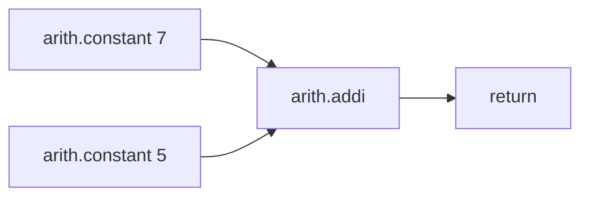

# Lesson 23-01：MLIR 基础与环境搭建

## 一、MLIR 基础概念

### 1.1 一句话理解

**MLIR（Multi-Level Intermediate Representation）是"造编译器的工具箱"**——它允许任何人定义自己的中间表示（方言/Dialect），并让多种方言共存、互操作、渐进式转换。

### 1.2 为什么需要它

传统编译器（如 LLVM）的 IR 是**固定单一**的。但 AI 芯片领域：
- 每种 NPU 指令集不同（高通 Hexagon、寒武纪、TPU…）
- 每种框架有自己的图表示（ONNX、PyTorch…）

用一套固定 IR 无法兼顾所有抽象层次。MLIR 的核心洞察：**不同领域的计算需要不同抽象层次的 IR，且这些 IR 应能共存、渐进式转换**。

### 1.3 三个核心概念

| 概念 | 类比（你熟悉的） | 说明 |
|---|---|---|
| **Dialect（方言）** | MNN 的算子注册表 | 一组 op/type/attr 的集合：`func`、`arith`、`tensor`、`linalg`、`scf`、`llvm`… |
| **Operation（操作）** | TVM 的 Relay 节点 / ONNX 算子 | 计算图节点，有 operand/result/attr |
| **Pass（变换）** | TVM 的 pass | 在 IR 上做优化（canonicalize）或降级（arith→llvm） |

关系：`方言定义有哪些 Operation` → `Pass 做变换` → `多次变换把高级方言渐进降到 LLVM IR`。

### 1.4 和你已有知识的对照

| 你做过的事 | MLIR 里的名字 |
|---|---|
| NPU算子宏+脚本翻译 asm | Conversion Pass |
| FRAM/WRAM 内存规划 | Bufferization + memref |
| DMA pingpong | software pipelining |
| 算子融合 conv+relu | linalg fusion |

---

## 二、环境搭建（从零到跑通）

### 2.1 前置条件

```bash
cmake --version   # ≥ 3.20
ninja --version   # ≥ 1.10
g++ --version     # ≥ 9（教程/LLVM 19 要求 C++17 以上）
```

### 2.2 目录约定

源码放仓库根目录 `mlir-src`（官方 llvm-project，与 `tvm-src`、`mnn-src` 同风格，不入库）。

```
<仓库根>/
├── mlir-src/            # 官方 llvm-project
│   ├── llvm/            # LLVM 核心
│   ├── mlir/            # MLIR 源码
│   └── build/           # 构建产物
│       ├── bin/mlir-opt        # 核心工具：读 IR、跑 pass、输出 IR
│       ├── bin/mlir-cpu-runner # 执行工具：JIT 执行 lower 后的 IR
│       └── lib/                # 运行时库
└── lesson-23-MLIR入门/   # 本课程笔记
```

先在 `.gitignore` 加上 `mlir-src`（源码不入库）：

```
# .gitignore 末尾追加
mlir-src/
```

### 2.3 拉取源码

```bash
cd <仓库根目录>

# 浅克隆稳定版 19.1.7（清华镜像，国内快，约 3.5G）
git clone --depth 1 --branch llvmorg-19.1.7 \
    https://mirrors.tuna.tsinghua.edu.cn/git/llvm-project.git mlir-src
```

> 为什么 19.1.7：稳定版。`--depth 1` 只拉该 tag 快照，省历史体积。

### 2.4 配置（每个参数都要懂）

```bash
cd mlir-src

cmake -S llvm -B build -G Ninja \
    -DLLVM_ENABLE_PROJECTS=mlir \
    -DLLVM_TARGETS_TO_BUILD=Native \
    -DCMAKE_BUILD_TYPE=Release
```

| 参数 | 含义 | 为什么 |
|---|---|---|
| `-S llvm -B build` | 源码目录 llvm/，构建目录 build/ | 官方标准布局 |
| `-G Ninja` | Ninja 构建 | 并行快、增量好 |
| `-DLLVM_ENABLE_PROJECTS=mlir` | 只构建 MLIR | 不需要 clang/lld，省大量时间 |
| `-DLLVM_TARGETS_TO_BUILD=Native` | 只生成宿主 CPU 后端 | 不需要 NVPTX 等，省时间 |
| `-DCMAKE_BUILD_TYPE=Release` | 发布版 | 编译快、产物小、运行快 |

### 2.5 编译（32 核约 10-15 分钟）

```bash
cd build

# 核心工具
ninja mlir-opt mlir-cpu-runner

# 运行时库（mlir-cpu-runner 执行 IR 必需！）
ninja mlir_runner_utils mlir_c_runner_utils
```

> **坑 1**：工具叫 `mlir-cpu-runner`，不是 `mlir-runner`（后者报 `unknown target`）。
> **坑 2**：`mlir_runner_utils`/`mlir_c_runner_utils` 不在默认目标里，必须单独编译，否则执行时找不到 `.so`。

### 2.6 验证

```bash
./bin/mlir-opt --version
# 期望：LLVM version 19.1.7，Optimized build
```

---

## 三、第一个程序

### 3.1 `A1_hello.mlir`（认识 IR 长什么样）

```mlir
// 最简 MLIR 模块：一个函数，返回常量 42
module {
  func.func @main() -> i32 {
    %0 = arith.constant 42 : i32
    return %0 : i32
  }
}
```

逐段解释：
- `module { ... }`：最外层容器（一个编译单元）
- `func.func @main() -> i32`：函数。**`func.` 是方言前缀**——属于 `func` 方言
- `%0 = arith.constant 42 : i32`：SSA 值 `%0`，`arith` 方言常量，类型 `i32`
- `return %0 : i32`：返回

> 前缀 `func.`、`arith.` 表示 IR 由多个方言协作——这就是"Multi-Level"的体现。

```bash
cd lesson-23-MLIR入门

# parse + 格式化打印
../mlir-src/build/bin/mlir-opt A1_hello.mlir
# 期望：%0 被重命名成 %c42_i32 后原样输出
```

### 3.2 canonicalize 优化

```bash
# --canonicalize：常量折叠、死代码消除等
../mlir-src/build/bin/mlir-opt --canonicalize A1_hello.mlir
```

> `mlir-opt` 是瑞士军刀：读 `.mlir` → 跑 pass → 输出 IR。这是你观察"优化前后 IR 变化"的核心工具，对应 TVM 的 pass。

### 3.3 完整执行链路（7+5）

新建 `A2_add.mlir`：

```mlir
// 完整执行测试：7 + 5 = 12
func.func @main() -> i32 {
  %0 = arith.constant 7 : i32
  %1 = arith.constant 5 : i32
  %2 = arith.addi %0, %1 : i32
  return %2 : i32
}
```

**关键认知**：`mlir-cpu-runner` 只能执行 **LLVM dialect**，不能吃高级方言。标准流程是**两步**：先 `mlir-opt` 把高级 IR **lower** 到 LLVM IR，再 runner 执行。

```bash
MLIR_OPT=../mlir-src/build/bin/mlir-opt
MLIR_RUNNER=../mlir-src/build/bin/mlir-cpu-runner
RUNNER_LIB=../mlir-src/build/lib

# step 1: 降到 LLVM IR（观察降级结果）
$MLIR_OPT A2_add.mlir \
  -pass-pipeline="builtin.module(func.func(convert-arith-to-llvm),convert-func-to-llvm,reconcile-unrealized-casts)"

# step 2: JIT 执行，期望输出 12
$MLIR_OPT A2_add.mlir \
  -pass-pipeline="builtin.module(func.func(convert-arith-to-llvm),convert-func-to-llvm,reconcile-unrealized-casts)" \
  | $MLIR_RUNNER -e main -entry-point-result=i32 \
      -shared-libs=$RUNNER_LIB/libmlir_runner_utils.so \
      -shared-libs=$RUNNER_LIB/libmlir_c_runner_utils.so
```

管线解释（最小的 lowering 链）：
| pass | 作用 |
|---|---|
| `convert-arith-to-llvm` | arith（算术）→ llvm |
| `convert-func-to-llvm` | func（函数）→ llvm |
| `reconcile-unrealized-casts` | 清理降级产生的临时 cast |

> **观察点**：step 1 输出里 `%2 = llvm.mlir.constant(12 : i32)`——LLVM 层自动把 `7+5` 折叠成 `12`，这是 LLVM 优化在 MLIR 链路上生效的证据。

---

## 四、代码逐行解剖（小白向）

> **最关键的一句话**：`.mlir` 文件不是"代码"，是**"图"的文字描述**。
> MLIR 在内存里维护的是一张计算图（就像你熟悉的 ONNX 图、TVM 的 Relay 图），`.mlir` 文本只是这张图被打印出来的样子。读它 = 读一张打印出来的图。

### 4.1 用 C 语言对照读懂 `A1_hello.mlir`

```mlir
module {                                    // 一张图的边界
  func.func @main() -> i32 {                // int main() {
    %0 = arith.constant 42 : i32            //   int tmp0 = 42;
    return %0 : i32                         //   return tmp0;
  }                                         // }
}
```

| MLIR 写法 | 含义 | C 语言类比 |
|---|---|---|
| `module { }` | 一整张图的边界 | 一个 `.c` 翻译单元 |
| `func.func @main` | 定义函数 main | `int main()` |
| `@main` | 函数名（`@` = 符号名） | `main` |
| `func.` / `arith.` | **方言前缀**（属于哪个方言） | 命名空间（`std::` 的 `std`） |
| `%0` | SSA 值（一旦定义不可变） | 临时变量（但**不能重新赋值**） |
| `arith.constant 42` | arith 方言的"常量"操作 | 字面量 `42` |
| `: i32` | 结果类型标注 | `(int)` |
| `return %0` | 返回 %0 | `return tmp0;` |

**为什么要有方言前缀？** 因为同一件事不同方言都能干——"函数"这个概念 `func` 方言有、`llvm` 方言也有（`llvm.func`）。前缀就是告诉读者"这行字用的是哪套词典"。

### 4.2 用 C 对照读懂 `A2_add.mlir`

```mlir
%0 = arith.constant 7 : i32       // int tmp0 = 7;
%1 = arith.constant 5 : i32       // int tmp1 = 5;
%2 = arith.addi %0, %1 : i32      // int tmp2 = tmp0 + tmp1;
return %2 : i32                   // return tmp2;
```

| 写法 | 含义 | 类比 |
|---|---|---|
| `arith.addi` | arith 方言**整数加法**（add integer） | C 的 `+` |
| `%0, %1` | 两个操作数 | `tmp0 + tmp1` 的两个操作数 |
| `%2` | 结果 | 结果临时变量 |

**画成图**（这就是 MLIR 内存里的真实结构——一张有向无环图）：



这就是**为什么叫 IR（中间表示）**——它不是给人读的 C 源码，也不是机器能跑的机器码，而是夹在两者之间的"编译器内部的图结构"。

### 4.3 ⚠️ 最重要的区别：`%0` 不是"变量"

C 里 `x = 5; x = 6;` 可以改 x。**MLIR 里不行**——这叫 **SSA（静态单赋值）**：

```mlir
%0 = arith.constant 42 : i32
%0 = arith.constant 43 : i32   // ❌ 错误！%0 已被用过
%1 = arith.constant 43 : i32   // ✅ 正确，重新编号
```

**为什么？** 编译器优化（如常量折叠）依赖"值不变"这个性质——值能被改的话，优化器无法确定它到底是什么。所有现代编译器内部 IR 都是 SSA（TVM 的 Relay、MNN 的图也是）。

### 4.4 两个命令在做什么

| 命令 | 本质 | 类比 |
|---|---|---|
| `mlir-opt A1_hello.mlir` | 读图 + 打印图（会格式化，`%0`→`%c42_i32`） | `clang -S` 打印汇编给人看 |
| `mlir-opt --canonicalize` | 跑优化 pass（常量折叠/死代码消除/统一写法） | TVM 的 `fold_constant`、ORT 的图优化 |
| `mlir-opt ... -pass-pipeline="..."` | 跑一串 lowering pass，把高级方言翻译成 LLVM | **你 T41 的"宏+脚本翻译 asm"** |
| `mlir-cpu-runner` | JIT 编译并执行 lower 后的 IR | 链接器 + 运行器 |

**为什么不能直接执行？** 因为 `arith`/`func` 是"给人看的图"，CPU 不认识。必须一步一步翻译成 CPU 认识的语言——这个过程就是 **lower（降级）**：

```
arith.constant 42  →  llvm.mlir.constant 42   （高级常量 → LLVM 常量）
func.func @main    →  llvm.func @main         （高级函数 → LLVM 函数）
return             →  llvm.return             （高级返回 → LLVM 返回）
```

**这就是你 T41 做的事的通用化**：你手写脚本把算子翻译成 NNMAC 指令，MLIR 用 pass 把高级方言翻译成 LLVM 方言。同一个动作，MLIR 把它做成**可复用、可测试**的 pass。

### 4.5 Makefile 逐行解读

```makefile
MLIR_OPT := ../mlir-src/build/bin/mlir-opt     # 定义变量（:= 赋值）
PIPELINE := builtin.module(...)                # 给长命令起短名，类似 C 的 #define
...
A2_add: A2_add.mlir                            # 规则：目标: 依赖
	$(MLIR_OPT) A2_add.mlir -pass-pipeline="$(PIPELINE)"   # $(X) = 引用变量
```

- `$(PIPELINE)` 就是展开成变量的值——**拼写不一致（POPLINE vs PIPELINE）会展开成空**，导致 `-pass-pipeline=""` 报错（本课踩过的坑）
- `A2_add: A2_add.mlir` = 如果依赖文件存在就执行缩进的行
- `.PHONY` = 声明目标是命令名而非文件名

### 4.6 符号速查表

| MLIR 写法 | 什么意思 | 你会的东西 |
|---|---|---|
| `module { }` | 一张图的边界 | ONNX 模型 / TVM IRModule |
| `func.` `arith.` | 方言前缀（词典） | C 的命名空间 |
| `func.func @main` | 定义函数 main | `int main()` |
| `%0` | 一个 SSA 值（不可变） | 临时变量（但不能改） |
| `arith.constant 42` | 常量 42 | 字面量 `42` |
| `arith.addi %0, %1` | %0 + %1 | `tmp0 + tmp1` |
| `: i32` | 类型标注 | `(int)` |
| `return %0` | 返回 | `return tmp0;` |
| `mlir-opt` | 读图+打印图+跑 pass | 编译器前端工具 |
| `--canonicalize` | 优化 pass | TVM 的 fold_constant |
| `convert-arith-to-llvm` | 高级方言→LLVM | 你 T41 的脚本翻译 asm |
| `mlir-cpu-runner` | JIT 编译执行 | 链接器+运行器 |

**现在回头看 `A1_hello.mlir`，它其实就等价于**：

```c
// 一个什么都不干、返回 42 的程序
int main() {
  int tmp0 = 42;
  return tmp0;
}
```

MLIR 只是把它写成图 + 类型标注的形式，方便编译器在中间做优化。

---

## 五、什么是 Pass（重点）

### 5.1 一句话

**Pass = 一个"把 IR 图变成另一张图"的变换。输入一张图，输出一张图，中间做一件事。**

你在这课已经跑过两个 pass，直接用它们理解：

```bash
# pass 例子 1：canonicalize —— 优化（让图更简单）
mlir-opt --canonicalize A1_hello.mlir

# pass 例子 2：convert-arith-to-llvm —— 降级（让图更接近机器）
mlir-opt ... -pass-pipeline="...convert-arith-to-llvm..."
```

### 5.2 类比：pass 就是"加工流水线上的一个工位"

想象一条编译流水线，IR 图像零件一样流过每个工位，每个工位只干一件事：

```
输入图（高级方言）                 输出图（低级方言）
┌──────────┐    ┌──────────────┐    ┌──────────┐
│ arith.addi │ → │ canonicalize │ → │ 折叠成常量 │ → ...
│ func.func │    └──────────────┘    └──────────┘
└──────────┘        工位 1                ↓
                 ┌──────────────┐    ┌──────────┐
                 │ convert-arith│ → │ llvm 方言 │ → 交给 runner
                 │ -to-llvm     │    └──────────┘
                 └──────────────┘      工位 2
```

**每个工位（pass）只认"进来的图长什么样 + 出去要变成什么样"**，不关心前后工位。这就是编译器的模块化——加一个新优化 = 加一个新工位，不动其他工位。

### 5.3 两类 pass（本课都见过了）

| 类型 | 干什么 | 本课例子 | 类比 |
|---|---|---|---|
| **优化 pass**（Optimization） | 让图**更简单/更快**，方言不变 | `canonicalize`（常量折叠 7+5→12） | TVM 的 `fold_constant`、ORT 图优化 |
| **转换 pass**（Conversion） | 把图从一种方言**翻译**成另一种 | `convert-arith-to-llvm`、`convert-func-to-llvm` | 你 T41 的"宏+脚本翻译 asm" |

> 区分诀窍：**优化 pass 前后都是同一批方言**（arith 还是 arith，只是更精简）；**转换 pass 前后方言变了**（arith → llvm）。

### 5.4 pass 在编译器里的位置

MLIR 的整个设计就是"**图 + 一串 pass**"：

```
读入 .mlir → [pass][pass][pass]... → 输出 .mlir 或交给 runner 执行
            ↑ 这就是 pass pipeline（pass 管线）
```

你 `-pass-pipeline="builtin.module(...)"` 里写的那一串，就是**告诉 mlir-opt 按什么顺序过哪些工位**。

### 5.5 为什么这是"编译器工程师的日常"

芯片公司的工具链工作，本质就是**写 pass**：
- 写一个优化 pass：把 conv+relu 融合
- 写一个转换 pass：把自己的方言翻译成 linalg / LLVM（对应你 NPU指令 翻译 asm）
- 调 pass 顺序：不同顺序效果不同（这就是 pass pipeline 调优）

**所以你学的不是"MLIR 语法"，是"怎么写编译器的一个零件"**——这正好接上你 T41 的经验，只是从"一个人脑跑完所有步骤"变成"每个 pass 独立、可测试、可复用"。

### 5.6 本课你实际看到的 pass 效果回顾

| 命令 | pass | 你看到的输出变化 |
|---|---|---|
| `mlir-opt --canonicalize A1_hello.mlir` | canonicalize | `%0` → `%c42_i32`（命名规范化），结构不变 |
| step1 lower 链 | convert-arith/func-to-llvm | `arith.addi` → `llvm.mlir.constant(12)`（**7+5 被折叠成 12**） |
| step1 lower 链 | reconcile-unrealized-casts | 清理降级留下的临时 cast |

> 那个 `12` 就是 **canonicalize/LLVM 优化 pass 在 lower 过程中顺手做的常量折叠**——你第一次亲眼看到"编译器在中间层优化"的全过程。

