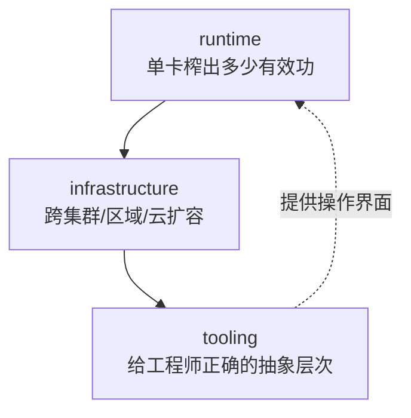

# 01 全景：三层与六技术

> **对应原书**：Chapter 0: Inference（约 8 页）
> **本课定位**：全书骨架。只有 8 页但最关键——建议先只读这一章就建立全局观，后面七章都是在展开它。

---

## 1. 一个前提判断：推理是 operation，不是 project

原书开篇就立了个基调，值得放在最前面：

| | 训练 | 推理 |
|---|---|---|
| 性质 | **project（项目）** | **operation（运营）** |
| 边界 | 有开始、有预算、有结束 | **没有结束日期** |
| 负载来源 | 你自己定 | **别人定的** |
| 成本关系 | 花掉预算 | **随你成功而增长** |
| 失败模式 | 浪费预算 | **产品本身挂了** |

作者用一段对比说明为什么生成式模型打破了过去十年的经验：以前服务一个 XGBoost 模型，一台 CPU + Flask + 几 MB 模型文件，"整个东西能装进脑子里，有意思的问题都在上游的特征工程"。现在不一样了，三件事变了：

1. **权重大到"放哪"成为架构决策**
2. **输出逐 token 生成**——一次响应是几百次串行的前向，而不是一次
3. **需求是尖峰的**，批处理时代没见过

> 💡 **跟你的呼应**：你做的 ECNR/KWS 是**流式**推理（有状态、逐帧），和"训练是一次性的"这个区分天然合拍。面试时如果被问"部署和训练的差别"，用"operation vs project"这个框架开头很省事。

---

## 2. 三层框架（the three layers）

做推理要同时解三个问题，**而且它们不互相替代**——一个团队可以某一层做到极致，服务依然没人敢依赖。



| 层 | 解决什么 | 归属问题域 | 典型技术 |
|---|---|---|---|
| **runtime** | 单个模型在单个 GPU 实例上的性能 | 内核、引擎、调度 | CUDA、PyTorch、vLLM/SGLang/TensorRT-LLM、FlashAttention |
| **infrastructure** | 一个实例永远不够——复制、路由、扩容 | **分布式系统** | K8s、自动扩缩、多云、队列 |
| **tooling** | 抽象层次的平衡 | 开发者体验 | 部署接口、可观测、日志 |

### 2.1 runtime：最窄的一层

作者对 runtime 的定义非常干净，我建议直接背下来：

> **一个模型、一个实例，问题是你从已经付了钱的 GPU 里榨出多少有效功。**

他还有个提醒：**"从 web 服务转过来的人会惊讶于底层工作在这里有多重要——一个更好的 attention kernel 比大多数应用层的聪明技巧更值钱。"**

### 2.2 infrastructure：性质随规模变化

这层的形态**随规模变**，作者给了清晰的阶段划分：

| 阶段 | 规模 | 核心问题 |
|---|---|---|
| 早期 | 单集群 | **自动扩缩**——什么时候加/减副本，怎么加快 |
| 过几百张卡 | 多集群 | **容量**——要去多区域、多云抢卡 |
| 更大 | 全局 | **消除孤岛**——把一切当作单一算力池 |

他特别强调：**这一层不是 CUDA 问题也不是 PyTorch 问题，是分布式系统问题。**

> 💡 **这一层是你的盲区**。你在 T41 和前司都在"单设备/单板"的世界里，infrastructure 是云侧岗位会问的部分。本课 [09 生产部署](09_生产部署.md) 覆盖，但不建议花太多时间——知道有这三个阶段、知道"孤岛"问题的存在就够了。

### 2.3 tooling：被跳过最多的一层

作者的判断很犀利：

> 这层是团队跳过的，因为**在两个硬骨头旁边它显得像额外开销**。但它是其他一切的操作界面，**它缺位的表现是"团队没法在没有某个特定的人在醒着的时候部署"。**

他把开发者体验画成一条光谱：

```
黑盒 ←───────────────────────────────→ 裸构件
给平台丢权重                         只给 compute/network/disk
拿回一个 API
        ↑
   正确的位置在中间：
   控制力足够跑 mission-critical
   抽象足够让人有生产力
```

> 💡 **面试可用**：如果被问"工具链工程师的价值在哪"，这就是答案——**tooling 是让另两层能被反复使用的那一层**。

---

## 3. 六个技术（six techniques）

这六个就是第 5 章的目录，也是全书出现频率最高的词：

| 技术 | 一句话 | 本课章节 |
|---|---|---|
| **Batching** | 并行跑多个请求，按 token 级别交织，提升吞吐 | [07](07_投机_缓存_并行_拆解.md) |
| **Caching** | 在共享前缀的请求间复用 KV cache | [07](07_投机_缓存_并行_拆解.md) |
| **Quantization** | 降低模型部分组件的精度，换更多算力和更少内存 | [06](06_量化_动态范围与粒度.md) |
| **Speculation** | 生成并验证草稿 token，一次前向出多个 token | [07](07_投机_缓存_并行_拆解.md) |
| **Parallelism** | 用多张卡加速大模型而不引入新瓶颈 | [07](07_投机_缓存_并行_拆解.md) |
| **Disaggregation** | 把 prefill 和 decode 拆到独立扩缩的 worker 上 | [07](07_投机_缓存_并行_拆解.md) |

**一个容易被忽略但重要的点**：作者明确说**这六个技术对多模态通用，不只服务 LLM**。VLM、embedding、ASR、语音合成、图像/视频生成都能用其中一部分——这也是第 6 章的立论基础。

---

## 4. 两个贯穿全书的"原则"

原书在不同的地方反复提到两个原则，我认为这是比技术细节更重要的东西：

### 原则一：约束越多，性能越好

$$ \text{更多约束} \;\Longrightarrow\; \text{更好的结果} $$

这是全书出现次数最多的观点（第 1 章讲应用场景时、第 4 章讲引擎选型时、第 5 章讲拆解时都出现）。

**推论**：
- 通用平台（vLLM）必须让出一些上限，因为有太多东西要兼容
- 窄框架（TensorRT-LLM）能更高，因为约束多
- "垂直 AI 应用应该尽量加约束、把用例说具体"

### 原则二：流量越大，能做的优化越多

$$ \text{更大流量} \;\Longrightarrow\; \text{更多可用优化} $$

**推论**：高模型并行、KV-aware 路由、动态拆解**都只在你有大量 GPU 时才有意义**。

> 这条原则解释了一个常见困惑："为什么书上讲的这些高级技术我公司用不上？"——因为**没到那个量级**。原书对此很诚实，多次明确说"没到这个量就去做别的"。

**第一条原则是"能做得多好"，第二条是"值不值得做"**。两句话一起用，就是一份决策清单。

---

## 5. 为什么量化、投机、并行这些词总是成对出现

作者有段话讲得很好，说明这些技术**不独立**：

> 技术之间有时**共生**、有时**互斥**。比如**量化 KV cache 会缓解拆解里的瓶颈**，但**加大 batch size 会减少投机可用的算力**。

所以工程师的目标不是"把这六个都开启"，而是：

$$ \text{找到一组平衡的优化组合，让总收益大于各部分之和} $$

> 💡 **这和你 T41 的经验完全同构**。你当时做的是：bank 冲突规避、DMA pingpong、循环内 if 消除、索引复用——这些也不是各自独立的最优，而是**互相牵制的一组选择**。"一组平衡的优化"这个说法可以直接迁移。

---

## 6. 本章小结与自测

### 关键认知（背这几句）

1. **推理是 operation 不是 project**——没有结束日期，负载由别人定，成本随成功增长
2. **三层不互相替代**——runtime 榨干单卡 / infrastructure 扩容 / tooling 提供操作界面，任一层缺位都会让服务没人敢用
3. **runtime 的定义**：一个模型、一个实例，问题是从已付钱的 GPU 里榨出多少有效功
4. **tooling 是被跳过最多的一层**，缺位表现是"没人醒着就发不了版"
5. **六个技术对多模态通用**，不只服务 LLM
6. **两条原则**：约束越多性能越好（能做多好）+ 流量越大优化越多（值不值得做）
7. **技术之间会互斥**，目标是找平衡组合而不是全开

### 自测

- [ ] 如果被问"推理和训练有什么本质区别"，你能用 30 秒讲清楚吗？
- [ ] 你现在的项目（KWS/ECNR）落在三层的哪一层？另外两层谁负责？
- [ ] 六个技术里，你已经亲手用过哪几个？（提示：量化用过，batching 用在 KWS 的 OpenMP 并行里）
- [ ] 你的场景满足"流量越大优化越多"吗？如果不满足，那些高级技术为什么用不上？

---

*下一章：[02 前置决策：度量与模型选择](02_前置决策_度量与模型选择.md)*
