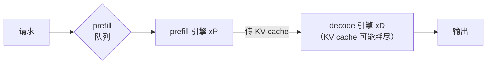

# 07 投机、缓存、并行、拆解

> **对应原书**：Chapter 5.2 - 5.5
> **本课定位**：四个提性能手段及各自代价。这一章是云侧岗位的**高频词来源**（TTFT/TPOT 之外的"黑话"都在这里）。
> **注意**：这四个和 [06 量化](06_量化_动态范围与粒度.md) 不同——**它们都是质量无损的**。

---

## 0. 章首的两个原则（比技术细节更重要）

原书第 5 章开篇有两段话，我认为比任何一个技术都值钱。

### 0.1 研究到生产的差距只有几个月

> **"在推理工程工作最酷的一点是：很多行业里新学术研究要几年甚至几十年才被产业采用，而这里——从新论文来的技术在几个月甚至几周内就上了生产。"**

作者点出：**研究和生产之间有一段鸿沟要跨，而业内最显眼的推理工程工作就来自跨越这条鸿沟。**

> 💡 **这对你的职业选择是个有力的论据**：如果你想做"研究落地"，推理工程是**反馈周期最短**的领域之一。这和编译器/AI 芯片工具链的处境类似（新算子/新精度格式的落地窗口也是一两年），但推理工程的窗口更短。

### 0.2 第二个原则：流量越大，能做的优化越多

$$ \text{流量越大} \;\Longrightarrow\; \text{能做越多优化（同时保持单位经济合理）} $$

**具体推论**：

> **高模型并行、KV-aware 路由、动态拆解，都只在你有大量 GPU（常常是多节点）服务同一个模型、有纵向规模和横向复制时才有意义。**

**还有两条很务实的话**：
1. **调参不是一次性任务**——通过迭代部署或运行时动态调整，可以持续改进
2. **真实流量抗拒约束**，但有了量级，你可以随时间调整系统去匹配变化的用法

### 0.3 一个真实故事：77 种配置

> **"我记得一次内部 hackathon，Baseten 的一位推理工程师在做代码自动补全模型，最后通过手写脚本试了 77 种不同配置，才找到一个非显然的方案，把客户模型的 TPS 翻了一倍。"**

**另外**：作者指出**技术之间有时共生、有时互斥**：

- **量化 KV cache 会缓解拆解里的瓶颈**（共生）
- **加大 batch size 会减少投机可用的算力**（互斥）

$$ \boxed{\text{目标是找到一组平衡的优化组合，让总收益大于各部分之和}} $$

> 💡 **这和你 T41 的经验完全同构**。你当时面对的是：bank 冲突规避、DMA pingpong、循环内 if 消除、索引复用——**它们也不是各自独立最优，而是互相牵制的一组选择**。
>
> **"一组平衡的优化"这个说法可以直接搬进简历和面试**，它比"我做了 A、B、C、D"更能体现工程判断力。

**本章五个主题的分类**（前四个是本章 + 量化是上一章）：

| 技术 | 质量影响 | 主要打什么瓶颈 |
|---|---|---|
| 量化 | **有损**（唯一有损的） | decode 带宽 + prefill 算力 |
| **投机** | 无损 | **decode 的 TPS（延迟）** |
| **缓存** | 无损 | **TTFT（prefill）+ 成本** |
| **并行** | 无损 | **模型太大装不下 / 提吞吐** |
| **拆解** | 无损 | **prefill 与 decode 互相干扰** |

---

## 1. 投机解码（Speculative Decoding）

### 1.1 原理：用闲置的算力换 token

**出发点**（回到 [03](03_模型机制与瓶颈计算.md) 的结论）：

$$ \text{decode 是带宽受限} \;\Longrightarrow\; \text{低到中等 batch 时算力闲置} $$

**那就用闲置算力去尝试"一次前向生成多个 token"**。

作者给的目标很清晰：

> **"如果推理引擎能在每次权重往返内存时生成两个、三个甚至更多 token，它就能每秒生成多得多的 token。"**

**⚠️ 一个必要的限定**：

$$ \boxed{\text{投机只改善 TPS/ITL，不改善 TTFT}} $$

**为什么**：TTFT 由 prefill 决定，而投机作用在 decode 阶段。**所以投机是"吐字快"的手段，不是"首字快"的手段**（对应 [02](02_前置决策_度量与模型选择.md) 的两阶段区分）。

### 1.2 通用机制（三步，所有算法共享）

```
1. speculator 生成一个或多个【草稿 token】
2. 【目标模型】对这些草稿做【验证】，检查是否与它会生成的相符
3. 目标模型接受合法草稿，并自己再生成一个 token，完成这次前向
```

$$ \text{每轮前向产出 } N+1 \text{ 个 token（N = 被接受的草稿数）} $$

**作者的类比非常好用**（强烈建议记下来）：

> **"如果你想象一个数独谜题，解它很难，但检查一个解是否正确非常容易。"**
>
> **对目标模型来说：生成一个 token 像解数独，验证一个草稿 token 像检查已完成的数独。**

**为什么验证便宜**：*"生成草稿 token 不是免费的，要花算力和内存。但目标模型验证一个草稿 token 比生成一个原始 token 快得多。"*

### 1.3 决定收益的三个因素

| 因素 | 说明 |
|---|---|
| **Draft token cost** | 生成一个草稿 token 要多久 |
| **Draft sequence length** | 每次前向生成几个草稿 |
| **Token acceptance rate** | 草稿被目标模型接受的百分比 |

**接受率的分布特性**（关键）：

> **"接受率在草稿序列早期很高，但越深越不可靠。"**

**由此得到一条明确的优化目标**：

$$ \boxed{\text{追求「短而高接受率」的序列}} $$

**为什么不能一味加长草稿**：
1. 生成和验证虽然比原始生成便宜，**但仍有可观开销**
2. **一旦某个草稿被判定错误，序列里它之后的所有 token 一起作废**

### 1.4 影响接受率（和适用性）的因素

| 因素 | 影响 |
|---|---|
| **Temperature** | **高 temperature 让 token 分布更难预测，降低投机效果** |
| **主题领域** | 连主题都有影响——**如果草稿模型/投机头更擅长数学而非历史，接受率就不同** |
| **Batch size** | ⚠️ **投机在低 batch（有闲置算力）时最有用；高 batch 时算力太饱和，必须动态禁用它** |

> 💡 **"高 batch 下要动态关闭投机"是个很好的面试细节**——它体现你理解"优化之间会互斥"（本章第 0.3 节的原则）。

### 1.5 四种方案对比

| 方案 | 机制 | 优点 | 代价 |
|---|---|---|---|
| **Draft-target** | 加一个**草稿模型**生成草稿，目标模型验证 | **开箱最快搭起来**，不需要训练/微调 | **开销最大** |
| **Medusa** | **给目标模型嫁接 2-4 个额外解码头** | 不用单独模型 | 草稿数和接受率有限；**今天生产里用得少** |
| **EAGLE** | **专门从零训练的草稿模型，吃隐藏状态** | 草稿可到 8 个、接受率高；**通用场景首选** | 需要训练；**要降 batch → 降吞吐、涨成本** |
| **N-gram / Lookahead** | **没有草稿模型**，靠字典查 | 草稿序列可超 10 个；**代码补全场景轻松超过 EAGLE** | **只在输出与输入相似时有效** |

#### 1.5.1 Draft-target 的细节

| 项 | 内容 |
|---|---|
| **最重要的决定** | **选哪个草稿模型** |
| 好草稿模型的标准 | **接受率高 + 跑起来资源需求小** |
| 常见做法 | **用目标模型同家族的小成员**（因为**共享分词器和行为**）|
| **经验法则** | **草稿模型参数量至少比目标模型小 10 倍** |
| 提升接受率 | **微调或蒸馏**这些小模型，让它们更像目标模型 |

**代价（作者列得很清楚）**：虽然草稿模型小，**但推理引擎必须把草稿模型的权重、激活、KV cache 都存进内存，还要分算力给它做 prefill**。而且**草稿和目标模型要协调运行以免抢资源**（TensorRT-LLM 这类引擎会处理这个编排）。

#### 1.5.2 Medusa 的历史地位

**解决的问题**：draft-target 要额外操作一个模型，太复杂。

**做法**：**微调目标模型本身**，让它一次前向生成更多 token——具体是**嫁接额外的解码头**：

$$ \text{普通 LLM} = 1 \text{ 个解码头} \qquad \xrightarrow{\text{Medusa}} \qquad +2 \sim 4 \text{ 个额外头（各生成一个顺序草稿 token）} $$

**局限**：草稿 token 数和接受率都受限，**今天生产里用得不多**——**但它启发了 EAGLE 这类更流行的技术**。

#### 1.5.3 EAGLE：通用场景的首选 ⭐

**为什么需要它**（这个洞察很精彩）：

> **用一个现成预训练小模型当草稿模型，根本问题是：Qwen 0.5B 这种模型的设计目标是"在便宜硬件上当一个好用的独立 LLM"，而不是"在 B200 上做投机草稿"。所以它们跑起来低效，接受率也相对低。**

**EAGLE 的做法**：**专门从零训练一个草稿模型**，目标是**生成最多 8 个草稿 token（比 Medusa 多一倍）且接受率很高**。

**它吃什么样的输入（核心机制）**：

> **推理时，LLM 会以层间隐藏状态的形式，积累大量关于"预测 token"的上下文。传统草稿模型拿不到这些信息。**
>
> **EAGLE 就是训练来吃隐藏状态作为输入、输出投机 token 的。具体是吃三个隐藏状态：一个来自早期层，一个来自中间层，一个来自后期层。**

| 规格 | 值 |
|---|---|
| 参数量 | **常常不到 10 亿** |
| 扩展性 | 给更多训练数据时**表现良好** |
| 落地形态 | 用 TensorRT-LLM 这类引擎时，常是**训练后创建 EAGLE + 单序列投机**，实现直白 |

**一个重要的工程优势**：

> **EAGLE 可以挂在目标模型的同一个模块（PyTorch class）上，于是每次前向同时跑目标模型和 EAGLE 投机器。这个统一流水线解决了 draft-target 的另一个问题——多轮往返 CPU 去编排草稿和目标模型。**

**代价（必须一起记）**：

> **"和其他投机技术一样，采用 EAGLE 来改善延迟需要降低 batch size，从而降低吞吐、提高成本。"**

#### 1.5.4 N-gram 投机与 Lookahead Decoding

**机制完全不同：没有草稿模型。**

```
并行于 KV cache 生成，引擎构建一个 n-gram 字典
字典把【一个起始 token】映射到一个【观察到的 N 个 token 的序列】
字典在 prefill 期间首次构建
decode 时：把生成的 token 喂进字典，取可用的后缀作为草稿
下一次前向：目标模型正常验证这些草稿
```

**与 EAGLE 的对比（这张对比很有价值）**：

| | EAGLE | N-gram |
|---|---|---|
| 草稿序列长度 | 约 8 个 | **可超过 10 个** |
| 接受率高的条件 | 普遍不错 | **只在模型输出内容与输入相似时高** |
| 擅长领域 | **通用** | **代码补全、代码修改** |

**为什么擅长代码**：*"语法可预测，输出与输入高度匹配。"* 作者明确说：**在这个特定领域，它轻松超过 EAGLE。**

**Lookahead Decoding**：类似方法，**在推理过程中生成 n-gram 来填充字典**。
- **比 n-gram 投机更通用**（不那么依赖高度重复的上下文）
- **但需要额外算力来生成 n-gram**

**本章对投机的总结**：*"N-gram 投机擅长代码补全和类似任务，而 Lookahead Decoding 在有富余算力的系统里更通用。"*

---

## 2. 缓存（Caching）

### 2.1 从 KV cache 到 prefix caching

**KV cache 是默认行为**：

> **"每个推理引擎都默认按请求做 KV 缓存。没有 KV 缓存，LLM 推理会慢到无法忍受，因为每个后续 token 都要把整个序列里此前所有值重算一遍。"**

**但复用空间更大**：

> **"工程师还能通过【在请求之间复用】KV cache 来获得更多效用，而不只是在单个推理序列内。"**

### 2.2 Prefix caching：机制与判据

**作者的例子**（两个 4-token 序列，共享 "Weather in" 前缀）：

```
请求 A: "Weather in" + [地点A]
请求 B: "Weather in" + [地点B]
           ↑
      共享前缀
```

**默认情况**：引擎必须对两个 prompt 的所有 4 个 token 各跑一遍 prefill。

**有了 prefix caching**：**第二个请求可以跳过前 2 个 token 的 prefill，直接读入已有的 KV cache**——**TTFT 因此改善**。

**一个顺带解释的日常现象**（很实用）：

> **"当你看到按 token 付费的 API 对『缓存命中』的输入 token 收费低于『未命中』时，原因就在这里——复用缓存 token 几乎不耗算力和时间。作为推理工程师，你可以把同样的原理用在自己的部署上来降延迟、提吞吐（从而省钱）。"**

### 2.3 何时收益巨大（四类场景）

| 场景 | 为什么 |
|---|---|
| **复杂 system prompt** | Agent、客服 chatbot、RAG 脚手架、工具调用，**每次调用都带着长而复杂的系统提示** |
| **代码补全** | 需要把**同样的几千行代码**作为共享上下文传进去 |
| **文档与检索** | 文档摘要、问答、检索**都在用户 prompt 前面加重复上下文** |
| **多轮对话** | **普通对话每轮都把此前的每条消息回放一遍**，所以**节省随轮数递增** |

### 2.4 ⚠️ 一条必须知道的规则：前缀在第一个不重复的 token 处结束

作者用两个对照例子讲得很清楚：

**有效的情形**（共享前缀在前面）：

```
A: "Weather in" [地点A] ?
B: "Weather in" [地点B] ?
    └── 共享 ──┘
→ 能省
```

**无效的情形**（第一个 token 就不同，即使后面全一样）：

```
A: [开头A] 后面三个 token 完全相同
B: [开头B] 后面三个 token 完全相同
   ↑
  第一个 token 就不同 → 【零收益】
```

**作者的规则总结**：

$$ \boxed{\text{要让 prefix caching 生效，就把新东西（novel token）尽量放到上下文的【后面】}} $$

$$ \text{上下文工程} \;\Longrightarrow\; \text{决定你的 TTFT 收益} $$

**为什么必须这样（根因）**：

> **LLM 是自回归的。每个 token 影响其后每个 token，所以【单个新颖 token 就会改变模型对序列其余部分的内部表示】，即使这些序列在人眼里看起来一样。**

### 2.5 非前缀复用（前沿）

**研究动机**：克服"只能从开头匹配"的限制。

**难点**（作者说得很准确）：

> **"缓存 prompt 中间任意位置的序列，需要同时修正位置编码（positional embeddings）并选择性地重算 KV 条目以维持输出质量。"**

**工具**：**CacheBlend**、**LMCache**。

### 2.6 KV cache 存哪里（四级存储 ⭐）

**先看配置的现实**：

> 你可以配置引擎分配多少内存给 KV cache。例如在 TensorRT-LLM 里设置一个比例。
>
> **具体算例**：B200 有 180 GB 显存，权重和缓冲用掉 100 GB，**那么分配剩余显存的 80% 即 64 GB 给 KV cache**。

**关键提醒**：

> **"一旦这个分配填满——而且它会很快填满——你就必须开始删除已存的 KV cache，这会增加未来请求缓存未命的概率。"**

**所以要往更远的存储卸载。四级存储（按到 GPU 的带宽降序）**：

| 层级 | 介质 | 大致速度 | 大致容量 |
|---|---|---|---|
| **G1** | **Device Memory（GPU VRAM）** | **TB/s 级** | **几十 ~ 几百 GB** |
| **G2** | **Host Memory（CPU RAM）** | **几十 ~ 几百 GB/s** | **几百 GB ~ 几 TB** |
| **G3** | **Local SSD** | **5-10 GB/s** | TB 级 |
| **G4** | **Networked SSD** | **GB/s 级** | **几十 TB** |

**作者的实操建议**：

> **"作为一般规则，你要让最常用的块留在更高带宽的内存里，而不常用的块可以下放到更慢的存储，直到需要时再取。"**

**某些 SKU（如 GB200）配有 CPU 和互联，G2 快得多，非常适合做 KV cache 卸载。**

> 💡 **这就是 [04 硬件](04_硬件_GPU与本地推理.md) 里 Grace/Vera 那节说的"CPU-GPU 互联 900 GB/s"的实际用途**——**高档的不是 CPU 算力，而是让 G2 这层更快的带宽**。
>
> **管理工具**：**NVIDIA Dynamo 通过 KVBM（KV Block Manager）支持 KV cache 卸载**，提供在不同内存层级间搬 KV 块的 API。

> 💡 **这一节和你的经验高度共鸣**：**G1→G4 的四级存储本质上就是你做 tiling 时面对的那套分层**（WRAM/FRAM → DDR → 外部存储）。你在 T41 做的"把热点数据留在片上、冷数据放远端"的判断，**在这里是同一套逻辑，只是规模从 KB 变成了 TB**。

### 2.7 缓存感知路由（生产环境必做）

**问题**：生产环境有**多个推理副本**，流量分散到各副本。**通常按"每个副本有多忙"来路由。**

**但如果你重度使用 prefix caching，路由逻辑就必须改**：

> **"一个在与 chatbot 长对话的用户、或连续问同一个代码库多个问题的用户，他们的请求应该尽量路由到同一个副本，这样才能吃到缓存命中，请求更快更便宜。"**

**另一种选择**：**用 G4 网络存储建一个跨副本的全局 KV cache**。

**但作者提醒路由仍然重要**：

> **"一个 G1 缓存滚烫的副本，比一个要读 G4 的副本服务得更快。但全局缓存能确保所有副本最终都能访问任何预计算过的序列，并且缓存的序列不会在节点轮回或自动扩缩时被销毁。"**

### 2.8 长上下文处理

**作者一个很好玩的自嘲式定义**：

> **"'长上下文'有点同义反复：当一个序列生成的 KV cache 大到足以在推理中造成问题，它就成了'长上下文'。"**

| 项 | 内容 |
|---|---|
| 常见阈值 | 依模型、硬件、引擎、流量而变，**常在 32K / 64K / 128K token 之后开始出问题** |
| 基准测试建议 | **一定要发超大的输入序列，测你的推理服务面对长上下文请求的表现** |
| 上下文窗口怎么来的 | 基础模型实验室用 **RoPE** 这类扩展技术解锁更长更准的上下文窗口 |

**长上下文在推理侧的新挑战**：

$$ \text{算上 KV cache，attention 随序列长度【线性】增长} $$

$$ \Longrightarrow \text{长序列下 attention 会成为 VRAM 的主要消耗者} $$

$$ \Longrightarrow \text{而 VRAM 恰恰是 decode 受限于的那个资源} $$

**通用的优化手段**（三个，都在别处讲过）：

| 手段 | 作用 |
|---|---|
| **FlashAttention** | 优化 attention kernel，减少读写 |
| **PagedAttention** | KV cache 分固定大小页存储，**减少碎片与重复** |
| **Chunked Prefill** | **把大输入序列切块**，在资源允许时与 decode 一起跑，**避免单个长序列把引擎压垮** |

**如果这些做完还不够显存装 KV cache**：**就得跨多 GPU 把推理并行化**（下一节）。

---

## 3. 模型并行（Model Parallelism）

### 3.1 先算需要几张卡（实用公式）

**基本换算**：

$$ \text{FP8 下，10 亿参数权重} \approx \textbf{1 GB VRAM} $$

**例子：DeepSeek-V3.1（671B 参数）**

$$ 671 \text{ GB 权重} \;\Longrightarrow\; \text{单张 B200 立刻 OOM} $$

**但"刚好塞下权重"远远不够**（这段算术很值）：

> **4×B200（720 GB）理论上能装下 DeepSeek 的权重。但没有留给 KV cache 的空间了——而权重之后剩余显存常常 80%+ 要留给 KV cache。所以 4 张 B200 无法以任何合理的序列长度或 batch size 服务 DeepSeek。**
>
> **实际需要一整个 8×B200 节点**才能服务 DeepSeek 这个量级的真实生产流量。

$$ \boxed{\text{最小 GPU 数} \approx \lceil \text{精度} \times \text{参数量} \times \text{预期 KV cache 分配} \rceil \;\text{向上取到可用实例规格}} $$

**作者补充**：即使对 GPT-OSS 这种中等模型，**你也想用超过最小数量的 GPU**，以换取更大的 KV cache 和更好的单用户延迟。

### 3.2 拓扑感知并行（为什么并行这么难）

**根本限制是卡间通信开销**：

$$ \text{NVLink / InfiniBand 虽然带宽高，但只是 VRAM 的一小部分} $$

$$ \text{而 decode 是带宽受限的} \;\Longrightarrow\; \text{多卡推理必须精心设计以避免卡间通信成为瓶颈} $$

**这个研究领域叫 topology-aware parallelism（拓扑感知并行）**。

### 3.3 三种并行方式对比 ⭐

| 方式 | 机制 | 缺点 | 适用 |
|---|---|---|---|
| **PP**（Pipeline Parallelism） | 每个 GPU 处理前向/后向的**一个 stage** | **不推荐**——逐步流水导致**延迟和利用率都差** | **仅用于多节点** |
| **TP**（Tensor Parallelism） | **把层内的张量拆到多卡** | **需要跨 GPU 同步**（all-reduce），**不适合多节点** | **单节点内低延迟推理的首选** |
| **EP**（Expert Parallelism） | **把 MoE 的整个专家分片到不同 GPU** | **需要卡间路由**才能碰到多个专家 | **MoE 提吞吐**，通信开销更低 |

**三种的定位**：

$$ \text{TP} \to \text{低延迟} \qquad \text{EP} \to \text{高吞吐} \qquad \text{PP} \to \text{只用于多节点} $$

**另外**：**Context Parallelism** 这类数据并行策略**在多卡间切分计算**——**在 LLM 推理里少见，但对视频生成必不可少**（见 [08](08_多模态_语音与生成.md)）。

#### TP 细节

**应该是多卡推理的默认策略**，**同时支持稠密模型（如 Llama 405B）和当前主导开放模型版图的 MoE**。

**机制**：

> **TP 把模型每一层拆开（对比 PP 保留层完整），把层的碎片分布到分配的 GPU 上。对每一层，读取权重内存和执行矩阵乘的代价被分摊到多卡。**

**MoE 的 TP**：**每个专家跨多张 GPU 运行**。

**代价与收益**：

$$ \text{每层结果需要以 all-reduce 方式合成单一输出，才能算下一层} $$

> **在卡内有高带宽 NVLink 和 NVSwitch 的节点里，这个通信开销被最小化。**

$$ \text{增大 TP} \;\Longrightarrow\; \text{改善单用户 TPS} $$

**前提条件（作者给了）**：*"假设模型足够大、序列足够长，使通信开销不超过更快前向带来的收益——**对大多数前沿模型都是这种情况**。"*

#### EP 细节

**机制**：**把专家整齐地分到各 GPU**。

**例**：**128 个专家的模型做 EP8（8 张卡）→ 每张卡承载 16 个完整专家**。

**收益**：

> **EP 改善系统总吞吐，让推理更可扩展、更便宜。因为各个专家分别处理 token，每个 token 花的时间一样，但系统整体能处理更多同时的 token。**

**为什么 EP 通信开销比 TP 低**（两个原因）：

1. **Expert Router（决定每个 token 激活哪些专家）被复制到每张卡上**——因为它相对小
2. **inter-GPU 通信只在专家间传 token，不像 TP 那样必须收集每层的结果**

$$ \Longrightarrow \quad \text{EP 能很好地扩展到多节点和互联带宽受限的系统} $$

**混合做法**：**很多部署 TP 和 EP 混用以获得两种好处**（比如 attention 用 TP、稀疏 MoE 层用 EP）。

### 3.4 多节点推理

**什么时候需要超过 8 张卡**：
- 服务超大模型且高精度
- 支持数百万 token 的输入序列
- 就是想跑得尽可能快

**多节点引入两个新挑战**：

| 挑战 | 内容 |
|---|---|
| **基础设施** | 怎么可靠地提供两个以上互联的 GPU 节点，并跨云建立抽象？（见 [09](09_生产部署.md)）|
| **并行** | 怎么在**比 NVLink 慢得多的 InfiniBand** 上有效通信？ |

**两个可行配方**（这是很实用的工程结论）：

| 模型类型 | 配方 | 说明 |
|---|---|---|
| **稠密模型** | **节点内 TP + 节点间 PP**（如 **TP8PP2**） | TP 跨节点通信太多 |
| **MoE 模型** | 也可以试 **EP**（如 **EP16**） | EP 通信开销比 TP 低 |

**MoE 下的取舍**：

$$ \text{TP8PP2} \;\to\; \text{更低的单用户延迟} \qquad \text{EP16} \;\to\; \text{更高的系统总吞吐} $$

**⚠️ 作者的实用建议（避免过度并行）**：

> **"除非你的模型和 KV cache 大到真需要多节点推理，否则多节点大概不是那些额外硬件的最佳用法。你往往更适合把额外节点用于横向扩展副本，或者用于拆解式服务。"**

---

## 4. 拆解（Disaggregation）

### 4.1 它把三个已知结论串起来

作者说 disaggregation **结合了推理工程的三个重要想法**：

1. **prefill 是算力受限过程，决定 TTFT；decode 是带宽受限过程，决定 TPS**
2. **专业化能改善一切**——从 kernel 选择到引擎参数调优
3. **只要能避免低带宽互联造成的瓶颈，就能把模型服务有效并行到多卡甚至多节点**

**问题从哪来**：

> **当 prefill 和 decode 跑在同一节点、且流量很重时，它们互相干扰的概率更高。理想情况下一个多用算力、一个多用内存，两者能高效共存。但随着 batch 变大、算力密集型优化上场，prefill 和 decode 开始抢资源。**

### 4.2 怎么工作

**三步流程**：

```
1. Prefill 引擎接收输入序列，生成 KV cache，同时算出第一个 token
2. Prefill 引擎通过硬件互联把 KV cache 传给 decode 引擎
3. Decode 引擎计算所有后续 token
```

**条件式拆解（conditional disaggregation）—— 更适合真实流量**：

先在 **decode 引擎**检查输入序列是否已缓存、或是否短到可以本地处理：

```
请求 → decode 引擎
         ├─ 已缓存 / 够短 → 【本地处理 prefill，跳过拆解】
         └─ 否则        → 转给 prefill 引擎做拆解式服务
```

**另一个收益**（这点很实用）：

> **"有了各自独立的 prefill 和 decode 引擎，你可以分别优化每个引擎、也能优化整个系统。比如算力受限的 prefill 引擎需要的 TP 比带宽受限的 decode 引擎更低。"**

$$ \text{prefill 引擎需要的 TP} \;<\; \text{decode 引擎需要的 TP} $$

### 4.3 什么时候才该用 ⚠️（三个条件必须同时满足）

| 条件 | 阈值 |
|---|---|
| **1. 大流量** | 每天 **1 亿 ~ 10 亿 token**（依模型大小而定）|
| **2. 大模型** | **至少 100B 参数** |
| **3. 流量以 prefill 为主** | **长输入序列** |

**不满足会怎样（作者的判断很直接）**：

> - **条件 1 或 2 不成立** → **你很可能在白花额外的硬件钱，换来极小的性能提升**
> - **条件 3 不成立** → **你更好的选择可能是把额外 GPU 用来横向扩展副本**，因为**对短序列或前缀缓存命中，decode 引擎更高效**

**教科书级用例**：

> **在代码编辑器里服务一个前沿 LLM**——**大量开发者同时把又大又各异的代码块作为上下文传进来**。**海量 token、以 prefill 为主、万亿参数模型** = 拆解的教科书工作负载。

### 4.4 xPyD 记法

> **prefill 和 decode 引擎不需要 1:1。真实系统里每种都有多个。**
>
> **数量写作 xPyD，例如 5P3D = 5 个 prefill + 3 个 decode 引擎协同服务同一个模型部署。**

### 4.5 拆解带来的新瓶颈



| 新瓶颈 | 缓解方式 |
|---|---|
| **prefill 队列长度** | **设合理的"本地 prefill"阈值**（在 decode 引擎上）+ **运行时重配 xPyD** 给 prefill 更多资源 |
| **高负载下 decode 引擎 KV cache 耗尽** | **量化** + **KV cache 卸载** |

### 4.6 Dynamo 的动态拆解

**Dynamo 提供生产级拆解支持**，三个具体能力：

| 能力 | 说明 |
|---|---|
| **prefill 队列** | 所有 prefill 引擎饱和时用来暂存请求 |
| **健壮的条件式拆解** | **prefill 路由基于可配置阈值**——**前缀缓存后的 ISL** 和 **prefill 队列大小** |
| **基于 NIXL 的高效 KV 传输** | 从 prefill 到 decode 引擎，**并含一个 kernel 在两个引擎 TP 配置不同时转置 KV 块布局** |

**合起来实现动态拆解**：**prefill 和 decode 引擎的数量在运行时可配，并能随时间调整以匹配流量变化。**

> 💡 **拆解这一节又一次印证了 [01](01_全景_三层与六技术.md) 的原则二**：**它是"流量越大，优化越多"最纯粹的体现**——作者给了明确的量级门槛（1 亿 token/天 + 100B 模型 + prefill 为主），**没到就别做**。

---

## 5. 本章小结与自测

### 关键认知

**投机的部分**
1. **投机只改善 TPS/ITL，不改善 TTFT**（它作用在 decode）
2. **三步机制**：草稿 → 验证 → 接受 + 自生成一个，**产出 N+1 个 token**
3. **数独类比**：生成像解题，验证像检查解
4. **追求短而高接受率的序列**——**一个草稿被拒，其后全部作废**
5. **temperature 高 → 投机效果差**；**高 batch 时必须动态关闭投机**
6. **draft-target 开箱最快但开销最大**；**草稿模型至少小 10 倍**
7. **EAGLE 是通用首选**：吃**三处隐藏状态**（早/中/晚），可出 **8 个草稿**，<1B 参数，**与目标模型同模块**免去 CPU 往返编排
8. **N-gram 无草稿模型**，靠 prefill 期间建的字典；**序列可超 10 个**，**但在代码补全领域轻松超过 EAGLE**

**缓存的部分**
9. **KV cache 是引擎默认行为**，prefix caching 是**跨请求复用**
10. **按 token 计费的 API 里"缓存命中"更便宜，就是这个原理**
11. ⚠️ **前缀在第一个不重复 token 处结束** → **把新东西放后面**（上下文工程决定 TTFT 收益）
12. **四类高收益场景**：复杂 system prompt、代码补全、文档检索、**多轮对话（收益随轮数递增）**
13. **KV cache 四级存储**：G1 VRAM（TB/s）→ G2 CPU RAM → G3 本地 SSD → G4 网络存储
14. **要配置 KV cache 分配比例**，而且**它很快会填满**
15. **缓存感知路由必做**——长对话/同代码库请求要回同一副本；也可用 G4 建**全局缓存**（但路由仍重要）
16. **长上下文 = KV cache 大到出问题**；**attention 随长度线性增长并吃掉 VRAM，而 VRAM 是 decode 的瓶颈**
17. 三个长上下文手段：**FlashAttention / PagedAttention / Chunked Prefill**

**并行的部分**
18. **FP8 下 10 亿参数 ≈ 1 GB**；DeepSeek 671B **光权重就让单张 B200 OOM**
19. **"刚好装下权重"远远不够**——**余下的 80%+ 要给 KV cache**，所以需要 8 卡整节点
20. **TP 管低延迟（单节点）、EP 管高吞吐（能扩多节点）、PP 只用于多节点**
21. **EP 通信开销低于 TP**：router 小且被复制；**不像 TP 必须 all-reduce 每层结果**
22. **多节点配方**：稠密用 **TP8PP2**；MoE 可试 **EP16**——**前者延迟低、后者吞吐高**
23. **没到需要就别多节点**，不如去扩副本或做拆解

**拆解的部分**
24. **条件式拆解更适合真实流量**（先让 decode 引擎判断能否本地处理）
25. **三个条件必须同时满足**：日均 1 亿+ token / 至少 100B 模型 / **流量以 prefill 为主**
26. **prefill 需要的 TP 比 decode 低**
27. **xPyD 记法**（5P3D）
28. **新瓶颈**：prefill 队列长度 + decode 侧 KV cache 耗尽
29. **教科书用例**：代码编辑器里服务前沿 LLM

**贯穿全章的两条**
30. **这些技术全部质量无损**（和量化不同）
31. **技术之间有共生也有互斥**——目标是**一组平衡的组合**，不是全开

### 自测

- [ ] 为什么投机不改善 TTFT？什么场景下投机反而该关掉？
- [ ] 用"数独"类比向别人解释投机解码，你能讲清楚为什么"验证比生成便宜"吗？
- [ ] 你的产品如果要用 prefix caching，你的 prompt 结构该怎么改？
- [ ] 为什么 EP 的卡间通信比 TP 少？对多节点部署意味着什么？
- [ ] 假设有人提议上 disaggregation，你会先问哪三个问题？
- [ ] 举一对"互相打架"的优化组合，并解释为什么。

---

*上一章：[06 量化](06_量化_动态范围与粒度.md) ｜ 下一章：[08 多模态](08_多模态_语音与生成.md)*
