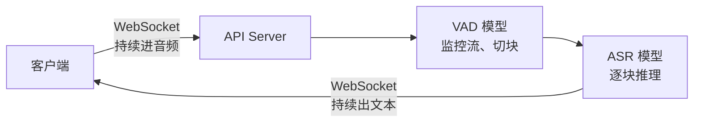
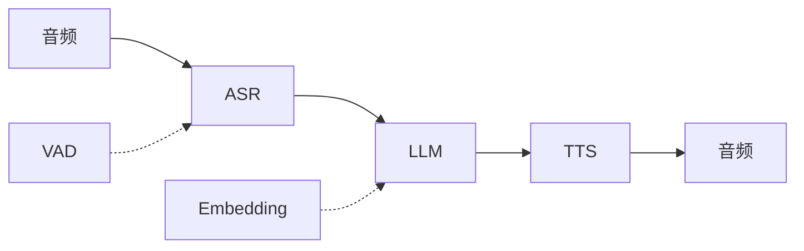

# 08 多模态：语音与生成

> **对应原书**：Chapter 6: Modalities
> **本课定位**：6.3 ASR / 6.4 TTS 和你的 **KWS / ECNR** 有可比性；6.1 的 VLM 和 6.5/6.6 的生成模型给你"其他模态怎么做推理"的参照系。

---

## 0. 模态全景与两种原型

### 0.1 模态总表（作者的框架很好用）

| 输入 | 输出 | 类别 |
|---|---|---|
| 文本 + 图像/视频 | 文本 | **Vision language** |
| 文本或图像/视频 | 向量 | **Embedding** |
| **音频（人声）** | **文本** | **Transcription（ASR）** |
| **文本** | **音频（人声）** | **Speech synthesis（TTS）** |
| 文本 | 音频（音乐） | Music generation |
| 音频 | 音频 | **Speech-to-speech** |
| 文本/图像 | 3D 模型 | Generative CAD |
| 文本/图像 | 图像/视频 | **Image/video generation** |
| 图像/视频 | 文本 | Captioning |
| 图像/视频 | 掩码 | Segmentation |
| 文本 + 图像 | 图像 | Image editing |

### 0.2 关键简化：模态虽多，原型只有两种

回到 [03](03_模型机制与瓶颈计算.md) 的划分：

| 原型 | 哪些模态 |
|---|---|
| **自回归 token 生成** | **VLM、embedding、ASR、TTS**，以及许多其他 |
| **迭代去噪** | **图像生成、视频生成** |

$$ \boxed{\text{多数非文本模型是 transformer 变体} \;\Longrightarrow\; \text{LLM 的工具链和手法基本能迁移}} $$

$$ \boxed{\text{图像/视频生成是例外} \;\Longrightarrow\; \text{架构、瓶颈、优化手段都不同}} $$

### 0.3 ⚠️ 每个模态都要重新想"怎么度量"（容易忽略）

> **"对每个新模态，你还需要调整思考和度量延迟、吞吐、质量的方式。"**

**作者的例子很精准**：

> **"比如 TTS 模型输出的单个音频 token 没什么用；你应该度量『到第一个字的时间』或『到第一句话的时间』，而不是 TTFT。"**

> 💡 **这条对你格外重要**：你做 KWS 时，"延迟"是**从最后一帧音频到出决策的时间**；做 ECNR 时是**逐帧处理的实时余量（RTF）**。**这两个都不是 TTFT 那种语义**——**面试时如果你能主动指出"语音类任务的度量语义和 LLM 不同"，会显得你真有工程判断**。

---

## 1. VLM（视觉语言模型）

### 1.1 结构

$$ \text{VLM} = \underbrace{\text{LLM}}_{\text{大}} + \underbrace{\text{Vision encoder}}_{\text{小，把图像/视频转成 image token}} $$

**参数量对比（说明 encoder 有多小）**：**Mistral Large 3 里，vision encoder 只有 20 亿参数，而 LLM 是 673B。**

**但作者强调一个小而关键的工程事实**：

> **虽然 vision encoder 按参数算很小，它对推理很关键。VLM 用的 vision encoder 架构和实现各异，所以 VLM 的运行时支持相对碎片化。这种碎片化提升了 vLLM 和 SGLang 在服务 VLM 时的重要性。**

### 1.2 核心算术（记住这个量级）

$$ \text{一张高分辨率输入图像} \approx \textbf{1000 个视觉 token} $$

**视频更夸张**：**1 秒电影级视频 = 24 帧**，每帧是图像 → **4 秒视频 ≈ 近 10 万 token 的输入序列**。

$$ \Longrightarrow \text{降采样在实践中几乎是必需的} $$

### 1.3 主要挑战：长输入 + 大 KV cache

| 阶段 | 影响 |
|---|---|
| **Prefill** | 图像被切 patch、嵌入、token 化，**作为输入序列的一部分进 prefill** |
| **Decode** | 机制相同，**但上下文更长**，有些模型还为 image token 加了 attention 变体 |

**上一章的五个技术全都用得上**：

| 技术 | 在 VLM 上的作用 |
|---|---|
| **量化** | KV cache 量化**降低长序列的内存带宽与存储开销** |
| **投机** | VLM 的 decode 与 LLM 相同，**尤其适合 EAGLE** |
| **前缀缓存** | **多轮对话与重复查询里复用图像的 KV cache** |
| **并行** | 用 TP 拿更快推理，同时访问更多 VRAM 支撑大模型与长上下文 |
| **拆解** | **把 prefill 移到专门且独立扩缩的 worker** 以处理长序列 |

### 1.4 VLM 特有的新权衡：降采样

| 表示 | token 数 | 信息 |
|---|---|---|
| 高分辨率 | **约 4 倍** | 更详细 |

$$ \text{降采样} = \text{新的质量-速度权衡} $$

**什么时候需要**：**单图输入一般不需要**；**传入多张图或视频片段时可能需要**。

### 1.5 Omni 模型的取舍（一段很清醒的话）

> **"Omni 模型有优点也有缺点——它们融合多种模态提供独特能力，但更小的专用模型在特定领域往往更快更准。"**

**一个具体例子**：

| | 能力 |
|---|---|
| VLM | 很多 VLM 把文字识别能力训进了图像处理，**但落后于专用 OCR 模型** |
| 专用 OCR | **通常只有 VLM 一小部分的规模** |

**推论**：**生产里跑 VLM 常涉及编排多条模型和预处理步骤的流水线**（PDF 抽取、OCR 读图、视频音频转写各用专门的预处理器）。
**要求**：**流水线里每个组件都要各自优化速度，并且独立扩缩以避免瓶颈**。

---

## 2. Embedding 模型

### 2.1 两种流量画像（先分清这个再谈优化）

| 画像 | 特征 |
|---|---|
| **高吞吐回填** | 批量操作：索引百万文档、更新商品目录、**甚至为 LLM 预训练准备数据** |
| **低延迟查询** | 用户面向的单次查询（搜索、检索、推荐），**每毫秒都影响体验** |

$$ \text{推理工程从"分清你要服务哪种画像"开始} $$

**作者的实用建议**：**如果两种都要，且量够大，建两套系统更好。**

### 2.2 两种架构

| 架构 | 特征 |
|---|---|
| **BERT 风格** | **encoder-only，通常 <1B**，原本为掩码 token 预测而建 |
| **LLM 基座** | 现代语言模型，**一般 ≤8B**，被改造来生成 embedding |

**今天 LLM 基座的明显更强**，但 BERT 风格仍用于**简单的延迟敏感任务（如分类）**。

### 2.3 维度作为旋钮

$$ \text{embedding 维度} = \text{输出向量的大小（几百到几千个值）} $$

**关键事实（容易搞反）**：

$$ \text{维度不显著影响推理时间} \quad\text{但}\quad \text{影响存储、检索、相似度计算的时间} $$

**Matryoshka 表示**：**在 embedding 维度和质量之间解锁动态权衡，同时在短向量上保留更多信息。**

**一个必须知道的坑**：

> **多数情况下，来自一个 embedding 模型的向量无法有意义地和另一个 embedding 模型的向量比较，即使长度相同——因为它们把输入编码进了不同的语义空间。**

### 2.4 推理优化要点

| 项 | 结论 |
|---|---|
| **运行时选择** | vLLM、SGLang、Infinity、TEI 都有；**但最佳性能来自把 TensorRT-LLM 改造来跑这些模型** |
| TensorRT-LLM 带来什么 | **优化的 XQA kernel 做快速 attention + 内核融合减少内存访问开销** |
| **量化** | **FP8 量化 embedding 权重能在最小质量损失下改善性能**（注意：模型越小越容易因量化掉质量）|

**量化验证方法（很简洁，值得记）**：

> **把相同输入分别跑原版和量化版，检查输出向量的余弦相似度。100% 表示完全相同；你要看到至少 99% 相似度才对这个量化有信心。**

> 💡 **这个验证方法可以直接迁移到你的工作**。你做 ECNR 时，如果量化后要验证，**逐层输出的余弦相似度 + 最终指标的逐条对比**是比"看平均 PESQ"更细的检查。**余弦相似度这个工具在 Lesson 21 的误差分析里也用过**。

### 2.5 ⚠️ 不适用的技术（这段避免你走错路）

| 技术 | 为什么不适合 embedding |
|---|---|
| **前缀缓存** | **embedding 模型并行处理 token** → 没有"前缀逐 token 依赖"这回事 |
| **拆解** | 同上，不适用 |
| **多卡并行** | **模型小，跨多 GPU 并行无效** |

**正确的路**：

$$ \text{高流量部署} \;\Longrightarrow\; \boxed{\text{横向扩展，每张 GPU 一个副本}} $$

**以及**：**批处理与队列在高流量 embedding 部署里作用很大**——**embedding 模型能吃比其他模型大得多的 batch size**（单个请求可能批量几十上百条文本，且很多请求能并行跑在一张卡上）。

---

## 3. ASR（自动语音识别）⭐ —— 和你的领域最接近

### 3.1 Whisper 的结构与规模

| 项 | 内容 |
|---|---|
| 主导开放模型 | **Whisper**（OpenAI 发布） |
| **最大版本参数量** | **仅 1.55B** |
| 支持的形态 | **几十种语言**，转写准确 |
| **硬件效率** | **在 H100 这类大卡的【分数】（MIG）上跑得极快** |
| 实用结论 | **多数延迟预算用最高质量的模型就能满足**（Whisper 3 Large / Turbo）|

**encoder-decoder 结构**：

| 部分 | 作用 |
|---|---|
| **Encoder** | 输入处理过的音频波形（**log-Mel 频谱图**），编码成音频特征 |
| **Decoder** | 把编码后的音频特征转成文本 token |

**⚠️ 一个决定优化方向的事实**：

$$ \text{推理时间的绝大部分花在 decoder 上} $$

$$ \text{而 decoder 是和 LLM 架构非常接近的自回归 transformer} $$

$$ \Longrightarrow \boxed{\text{LLM 的优化工具可以直接迁移}} $$

**主力工具**：**TensorRT-LLM**——拿到 **decoder 的 in-flight batching** + **优化的 C++ 运行时和高效 CUDA kernel**。**它对新架构（Hopper/Blackwell）配合极好，让 MIG 成为 ASR 推理更好的选择。**

> 💡 **这段对你极有价值**：**ASR/TTS 之所以能用 LLM 那套优化，根本原因是"decoder 就是 LLM"。** 你做的 ECNR（GTCRN 流式降噪）**不是**这种结构，KWS 也不是——**所以不能盲目套用 LLM 优化手法**。**能分清"哪些模态的结构真的和 LLM 同构"，本身就是判断力。**

### 3.2 单块延迟优化（实时转写）

**目标数字（请记住）**：

$$ \boxed{\text{约 200 毫秒往返} \quad\text{因为}\quad \text{这大约是人类的平均反应时间}} $$

**一个关键的方向性结论**：

> **"在优化过的 TensorRT-LLM 引擎上跑 Whisper，运行时层面没什么可做的了。实时 Whisper 的多数收益来自【编排和基础设施】。"**

**最大的产品体验升级是流式，而它实现在 API server 层，不是模型运行时层。**

**流式怎么做**：



**关键细节**：

| 项 | 内容 |
|---|---|
| **ASR 运行时层** | **什么都不变**——还是逐块正常推理 |
| **分块怎么切** | **用 VAD（Voice Activity Detection）模型监控进来流并切成离散块** |
| **结果怎么回** | **文本结果通过 WebSocket 流式回传** |
| 并发 | 这个设置能处理若干条并发流 |

**⭐ 一个很妙的额外好处（这个细节很值）**：

> **"当每个块在同一张 GPU 上处理时，你可以用【前一个块的输出序列】作为【下一个块的前缀】，从而改善转写质量。"**

> 💡 **这个模式和你的流式 ECNR 是同一类思想**：**跨块传递上下文/状态来改善连续性**。区别是：
> - **Whisper 传的是"上一个块的文本/序列前缀"**（语义级连续性）
> - **你传的是 `next_state`（特征级的隐状态）**
>
> **面试时这个类比很好用**——它说明你理解"流式模型为什么需要状态回灌"这件事的通用性。

### 3.3 长文件延迟优化

**限制**：**Whisper 只能支持 30 秒的块**。**一小时播客 = 120 个 30 秒块。**

**⭐ 度量指标 RTF（Real-Time Factor）—— 这个名字起得让人困惑，作者专门说了**：

> **"用名字令人困惑的 Real-Time Factor（RTF）来度量长文件转写的性能。如果世界上最快的打字员能手动在 30 分钟内转写完 1 小时音频，他的 RTF 就是 2X。用为长文件优化过的 Whisper 部署，你可以在 4 秒内转完 1 小时音频，RTF 为 1000X。"**

$$ \text{RTF} = \frac{t_{\text{处理}}}{t_{\text{音频}}} $$

| RTF | 含义 |
|---|---|
| **2X** | 人手动转写的水平（30 分钟转 1 小时音频）|
| **1000X** | 优化过的 Whisper 部署（4 秒转 1 小时音频）|

> 💡 **对照你的术语表 11.2：GX8006 上 RTF ≈ 0.044**。注意口径：
> - **本节的 RTF > 1 表示"比实时快"**（越大越好，因为分母是音频时长）
> - **你表里的 RTF = 0.044 是"处理 1 秒音频只用 44ms"**，**同一个定义**——0.044 = 44ms/1000ms ✅
>
> **所以两个是一致的**：你的 0.044 意味着**比实时快约 23 倍**，而本书说的 1000X 是**批处理式**（不要求实时，用多卡并行换吞吐）。**这个区分很重要**：**流式 RTF 和批处理 RTF 是两种不同的优化目标。**

**关键洞察（这就是为什么长文件好做）**：

> **"一个小时播客是 120 个 30 秒块，有用的性质是它们【互相独立】。长文件转写是一个【令人愉快地可并行】的问题，所以延迟下限由【你愿意铺多宽】决定，而不是由文件长度决定。"**

**这就是 [02](02_前置决策_度量与模型选择.md) 那个"延迟 vs 吞吐"权衡最清晰的形式。**

**完整流水线**：

```
① VAD 模型（这次跑在【自己专用的硬件上】）
   目的：去掉静音，切出有意义的音频段
   而不是：按固定时间间隔切（有把词切一半的风险）
        ↓
② 多个块【并行】处理
   理想情况用多 GPU（或多 MIG）一次处理更多块
   RTF 大致随 GPU 数量【线性】改善
   每张 GPU 用 in-flight batching 同时处理多块以保高利用率
        ↓
③ 按时间戳把分块转写【缝】回去
```

**⚠️ 并行化牺牲了什么，又怎么补回来**：

> **并行化分块转写，就失去了"用前一个序列当后一个序列前缀"的能力。但有其他质量改善手段，收益远超这个损失。**

**幻觉检测与修复**（这段很实用）：

| 项 | 内容 |
|---|---|
| **怎么自动检测幻觉** | **度量输出的压缩率和每分钟词数**（能发现重复的词/短语） |
| **发现某块有问题怎么办** | ① **用更高的 temperature 重跑这块**<br/>② **重新切块（整段或局部切成更小的块）再跑一遍** |

**反直觉但正确的一点**：

> **"用更高的 temperature 重跑——这很反直觉，因为更高的 temperature 一般产生更多幻觉——但【意图是打破重复词的循环】，生成一个不同的输出。"**

**作者的结论**：**"实践中，这些技术让『传递前一个序列作为前缀』变得不必要，从而解锁了高效且准确的长文件并行转写。"**

> 💡 **这条对你做 KWS 有直接启发**：**"检测异常 → 换策略重跑该片段"** 是处理长音频里局部失败的标准套路。**你在做长音频唤醒评估时，如果某段出现误唤醒聚集，用"重新分块 + 提高温度（对判别式模型则是换阈值/重采样）"来确认是不是边界效应——思路相通。**

### 3.4 Diarization（说话人分离）

**它和转写是相邻问题**，但作者明确指出**模型类别完全不同**：

| | Whisper（转写） | Diarization |
|---|---|---|
| 模型类型 | **encoder-decoder transformer** | **经典 ML 模型的流水线** |
| 例子 | Whisper | **pyannote audio** |
| 内部组成 | — | **分割 + 嵌入 + 聚类** 三个模型 |

**优化方式**：**要把每个模型都跑得快，并高效编排整条流水线**（可用 PyTorch + pyannote，配合 Torch 编译等优化）。

**⚠️ 一个重要的性能事实**：

> **"实践中，即使高度优化的 diarization 实现，处理一个音频文件也至少要【转写的两倍时间】。"**

**为什么更难并行**（这个理由和前面形成对比）：

> **说话人身份是整个录音的属性。第 90 块里的说话人必须被认出和第 3 块是同一个人——这抗拒了让转写易于扩展的"块独立性"。**

$$ \text{转写} = \text{块独立} \Longrightarrow \text{好并行} \qquad \text{diarization} = \text{全局属性} \Longrightarrow \text{难并行} $$

---

## 4. TTS（语音合成）

### 4.1 现代 TTS 就是微调过的 LLM

| 项 | 内容 |
|---|---|
| 代表模型 | **Orpheus TTS**（2025 年给开放模型生态带来极逼真的合成）|
| **来源** | **派生自 Llama 3.2 3B** |
| 行业动向 | **很多公司微调 Orpheus 以提升音质和做产品专属音色**，带动开放模型在语音 AI 领域高采用 |

$$ \boxed{\text{现代 TTS 是微调过的 LLM} \;\Longrightarrow\; \text{为 LLM 开发的大部分运行时和性能优化都适用}} $$

**硬件效率**：**TTS 参数量小（Orpheus 3B 已算大的）→ 和 ASR 一样，H100 的 MIG 是高效选项。**

**⭐ 一个和 ASR 的关键差异**：

| | ASR（Whisper） | TTS（Orpheus） |
|---|---|---|
| 精度 | **一般跑 FP16** | **权重和 KV cache 可以量化到 FP8** |

### 4.2 训练方式如何决定推理流程

**训练**：**扩大 LLM 的词表**，加入几万个编码后的音频 token，然后用"文本输入 + token 化音频输出"的配对训练。

**推论（这是 TTS 推理的独特瓶颈）**：

$$ \text{推理时还需要一个【音频解码器】，把输出的音频 token 转成波形} $$

**这个音频解码过程是潜在瓶颈**，作者给的工程建议很具体：

| 项 | 建议 |
|---|---|
| 实现 | **用 PyTorch 并针对目标 GPU 编译** |
| 批处理 | **用动态批处理 + 短超时（如 15 毫秒）** |
| ⚠️ 限制 | **音频解码器【不可能】用 in-flight batching** |

### 4.3 度量指标不同（呼应第 0.3 节）

| 指标 | 含义 |
|---|---|
| **TTFB**（Time to First Byte） | **语音合成版的 TTFT** |
| **到第一句话的时间** | **更以用户为中心**的延迟指标——生成第一个有意义短语/句子的时间 |
| **TPS** | TTS 也生成 token，所以 decode 速度可测 |

**目标**：**像 TTFT 一样，最小化 TTFB。Orpheus 在单张 H100 上可以做到 150 毫秒。**

### 4.4 ⭐ 一个反直觉但很重要的点：TTS 的 TPS 不是越大越好

> **"模型生成的 token 会被转成音频波形。取决于模型，【实时】生成音频可能需要每秒 80 到 100 个 token。超过这个水平，再生成更多 token 就没有收益了。"**

$$ \text{TPS 的目标不是最大化，而是"够实时"（约 80-100 token/s）} $$

**那性能提升该往哪走**：

$$ \text{方向转向提高【能同时支持的实时输出路数】} $$

> **"如果单张 GPU 能支持很多并发用户，语音合成的单用户成本就会大幅下降。"**

> 💡 **这条洞察很值钱，而且能迁移**：**在流式场景里，"够快"之后，优化目标应该从"降低延迟"切换到"提高并发"**。
>
> **你的 GX8006 场景同理**：RTF 0.044 说明延迟余量充裕（比实时快 23 倍），**所以进一步的优化价值不在"更快"，而在"能不能多跑几路 / 多模型并存 / 留出余量给其他任务"**。**这是从"性能优化"到"系统容量规划"的思维切换**——面试时说出来会显得成熟。

### 4.5 流式实时 TTS

**和 ASR 一样**：**性能收益主要来自基础设施，而不是运行时层**（后者已被 TensorRT-LLM、量化、编译过的解码器优化过了）。

**⭐ 一条实用的配置规则**：

> **"测试推理引擎确定能生成多少条并发实时流之后，把 batch size 和活跃 WebSocket 数设成同一个值，以保持使用率高但稳定。"**

$$ \text{batch size} \;=\; \text{活跃 WebSocket 数} \quad\Longrightarrow\quad \text{高而稳定的利用率} $$

**⚠️ 一个 TTS 特有的限制**：

> **"TTS 模型很少用于实时之外的场景。但如果你确实有批处理用例（比如把大量文档回填成音频以提升无障碍性），注意 TTS 模型不擅长长输入——超过大约 30 秒语音就开始退化。"**

### 4.6 Speech-to-speech

**今天的语音系统主流是级联式**：



> **"大多数语音系统用级联方式：ASR、LLM、TTS 三个模型组成流水线，来听、思考、回应用户。这些流水线还会用 VAD 和 embedding 模型等辅助组件来促成自然对话和补充上下文。"**

**Speech-to-speech 模型**（如 OpenAI 的 gpt-realtime）：**在一个核心 LLM 上增加音频消费与生产能力，实际上把流水线统一进单个模型。**

**为什么这可能（架构原因）**：

> **"这之所以可能，是因为 ASR、LLM、TTS 共享如此相似的架构，尤其在 decoder 上。"**

**⚠️ 作者诚实的现状判断**：

> **"在出版时，还没有商业可行的开放 speech-to-speech 模型，而闭源选项（如 gpt-realtime）的能力明显更弱、比级联多模型方案更贵。但这个方向研究很活跃，这个新兴模态很快会有自己的推理工程玩法。"**

---

## 5. 图像生成模型

### 5.1 和 LLM 的四个根本差异

| 维度 | 差异 |
|---|---|
| **架构** | **多数是迭代去噪器，不是自回归生成器**；是**多个小模型在 latent 空间协作的流水线**，不是 LLM 那种统一 decoder |
| **工具** | **SGLang Diffusion 和 vLLM Omni 都很新**；**多数图像/视频生成推理实现在栈的更底层——直接用 PyTorch 或 TensorRT** |
| **约束** | 模型比前沿语言模型**小 10-20 倍**，**受算力而非带宽约束** |
| **质量-速度权衡** | **图像/视频生成提供更直接的权衡** |

**⭐ 关于质量评估的一段很有意思的话**：

> **"用程序化方式评估图像模型输出质量很难。用 VLM 做的自动流水线最多给方向性信号，可能与人类偏好背离。人眼是神秘的，多数图像质量评测靠请人在几千张图里挑，把感觉和偏好聚合成质量基准。"**

### 5.2 一个反直觉的补充

> **"虽然图像生成理论上算力受限，你往往需要【先】选择内存高效的 kernel 并用 kernel 融合，才能到达那个瓶颈。"**

$$ \text{理论上 compute bound} \;\ne\; \text{随手跑就到 compute bound} $$

**作者点出**：**模型卡里的推理示例一般用 `diffusers` 库且几乎没做优化。**

### 5.3 三个可选实现路线

| 路线 | 特点 | 适合 |
|---|---|---|
| **SGLang Diffusion** | **为流行的图像/视频生成架构打造的推理引擎** | **想现在就有能用的** |
| **TensorRT** | **NVIDIA 内部 kernel 的黑盒高质量实现** | 同上 |
| **PyTorch** | **细致的 kernel 选择与融合，换来控制力、灵活性和更高的上限** | **想做深度定制的高级工程师** |

**作者的建议**：*"想要好用且现在就用 → 直接用 SGLang Diffusion 或 TensorRT 的实现。但用 PyTorch，有做深度定制的机会。"*

### 5.4 Kernel 优化的具体清单

**① attention kernel 最重要**

| 情况 | 选择 |
|---|---|
| 很多图像模型开箱用 | **FlashAttention 2** |
| Hopper 上 | **FlashAttention 3 更好** |
| Blackwell 上 | **FlashAttention 4 更好** |

**② 一堆小 kernel，尤其归一化**

> **"还有一整批更小的 kernel，尤其是 RMSNorm 这类归一化函数，是融合的好候选，以确保内存使用高效。"**

**③ GEMM kernel（算力受限时重要）**

- GEMM 作用于线性层
- **一般可以安全地量化到 8 位浮点格式**，以在 Tensor Core 上拿到**两倍 FLOPS**
- **CuTe、CUTLASS、DeepGEMM 的 kernel 可能在不同模型上最有效**（要逐个试）

**④ 编译与缓存**

| 项 | 内容 |
|---|---|
| torch 编译 | **含自动内核融合 + 插件系统插入手选内核** |
| ⚠️ **重要** | **编译要几分钟**，所以**结果引擎应该被缓存以加快节点启动** |
| ⚠️ **重要** | **编译针对特定 GPU 型号和架构**——**要在 B200 上跑就在 B200 上编译** |

### 5.5 ⭐ "一个奇怪的技巧"（这节很实用且有趣）

**前提回顾（来自 [03](03_模型机制与瓶颈计算.md)）**：

1. **图像生成时间与步数线性相关**
2. **每步实际跑两次前向**（有/无 prompt 条件）→ **每步的 batch size 是 2**

**guidance 参数的作用**：**控制合并两次生成时，prompt 引导的那张图占多少权重**。

$$ \boxed{\text{如果 guidance 是 0，那么 prompt 引导的那张图根本不需要生成}} $$

**关键洞察（作者的原话）**：

> **"前几步之后，图像的基本轮廓已经就位，剩下的步骤只是填充细节。因此，prompt 遵循性在【影响大笔触的早期步骤】更重要——模型不会在后面步骤改主意，在画猫画到一半时改成画狗。"**

**于是**：

$$ \text{在生成中途关掉 guidance} \;\Longrightarrow\; \text{省掉后段每步的那次无条件前向，【而不减少步数】} $$

**具体数字**：

| 配置 | 前向次数 |
|---|---|
| 50 步、全程开 guidance | **100** |
| 50 步、**最后 20 步关掉 guidance** | **80** |
| 质量 | **通常仍保持很高** |

$$ 100 \to 80 \quad\Longrightarrow\quad \textbf{省 20\% 前向} $$

> 💡 **这个技巧的价值在于它示范了一种思维方式**：**先分析"哪部分计算对结果真的重要"，再针对性地砍掉冗余计算**——而不是无脑优化每个 kernel。
>
> **这和你在 T41 做的"循环内 if 消除"是同一类优化**：**不是让每条指令更快，而是发现"某些计算在特定条件下根本不需要做"。** 这类优化的收益往往比 kernel 微调大得多。

---

## 6. 视频生成模型

### 6.1 为什么是最吃资源的模态

**硬件建议**：**尽可能跑在 Blackwell（或 Rubin，一旦可用）上**。三个理由：

1. **高显存容量支持 Context Parallelism**
2. **快速的 Tensor Core 做 attention 计算**
3. **微缩放数据格式做更精确的量化**

**架构**：和图像生成相似，只是**从 latent 空间渲染整个视频而不只是一帧**。

**遵循"规模越大解锁越多技术"的原则**：**视频生成用图像生成的所有技术，外加更多优化。**

### 6.2 三个关键事实（都很反直觉）

| 事实 | 内容 |
|---|---|
| **步数** | **和图像差不多（约 50 步），但每步处理的数据多得多** |
| ⚠️ **batching 没用** | **因为算力受限** |
| ⚠️ **batch size = 1** | **通常跑在 8 卡整节点上，八张卡合力一次出一个视频** |

**由此得到一个很硬的结论**：

> **"不像批处理负载那样可以调 batch size 来做延迟-吞吐权衡，视频生成改善吞吐和成本的【唯一方法就是让模型本身更快】。"**

**为什么必须整体处理**：
- 早期视频模型是**逐帧**的，**降低了输出质量与连贯性**
- 今天**对视频整体在 latent 空间跑去噪步**
- **latent 是三维的**：图像是（宽、高），**视频是（宽、高、时间）**

**⭐ 最重要的数字**：

$$ \boxed{\text{对视频模型，attention 占总【算力时间】的 70\% - 80\%}} $$

$$ \Longrightarrow \text{attention 是最该优化的东西} $$

### 6.3 Attention 优化

**① Kernel 选择**：**逐个测 FlashAttention、DeepGEMM、CuTe、CUTLASS 看哪个在你的模型上最好。**

**② 缓存（视频特有的强大手段）**：

> **"语言模型用 KV cache 加速 attention，而视频生成模型用其他缓存模式来尝试复用模型输出。复用部分 attention 计算在实践中能让视频生成快 30-40%。"**

| 缓存类型 | 机制 |
|---|---|
| **Timestep-based** | **缓存并复用某些时间步的输出，从而跳过整个步骤** |
| **Transformer-based** | **缓存并复用隐藏状态，跳过 transformer 内部的层** |

**⚠️ 风险警告**：

> **"算法和实现的范围从可忽略的质量退化到不可用的输出都有——生产使用前要仔细测这些策略。"**

**③ 量化：和语言模型的侧重点完全不同 ⭐（这是本节最有价值的对比）**

| | 语言模型 | 视频模型 |
|---|---|---|
| 量化的收益来源 | **减少内存搬运**（带宽受限） | **切换到低精度 Tensor Core 拿到 2 倍 FLOPS**（算力受限）|
| **量化重点** | **权重**（大的线性层，占内存带宽大头） | **attention**（权重层只占算力时间一小部分）|

> **"语言模型的量化聚焦在权重——那里量化的影响可忽略。对视频模型，量化权重仍然有帮助，但这些层在视频模型里只占算力时间的一小部分。"**

**为什么 attention 量化在这里风险略低但依然重要**：

> **"attention 是任何模型里最危险量化的部分，因为误差会在推理过程中累积。但对视频模型，这里只有约 50 步而不是几千次自回归迭代，所以【风险略低但依然重要】。"**

**三个具体手段**：

| 手段 | 做法 |
|---|---|
| **① 块级量化 + 微缩放格式** | 用 **MXFP8**（Hopper/Blackwell 都可用）——**微缩放格式更好地保留离群值，而离群值对 attention 精度影响重大** |
| **② 按步选择性量化** | **早期步保持 FP16，后期步量化** |
| **③ 按层选择性量化** | **保留首尾层，只量化隐藏层** |

**② 和 ③ 的理由（和"关掉 guidance"技巧同源）**：

> **"按步量化沿用了图像生成里 classifier-free guidance 技巧的同一个洞察：早期步骤建立图像轮廓，后期步骤精修细节。这些早期步骤对 prompt 遵循性和准确性更重要。"**
>
> **"对层来说，首尾层更重要，因为它们接收输入并产生最终输出。隐藏层只做中间计算，不太受近似影响。"**

**落地形态**：**这些策略体现在 SageAttention 这样的 kernel 里——一个 8 位 attention kernel，可用于视频生成模型上质量不错的低精度 attention。**

> 💡 **这个"按步/按层选择性量化"的思路对你极有价值**：
>
> **它对应的正是你的短板 1（量化理论）里缺的那部分**——**不是"全模型统一一个精度"，而是"按敏感度分配不同精度"**。
>
> **而且它的判据（"早期步定轮廓、首尾层管输入输出"）是一种可迁移的结构直觉**：
> - 你做 KWS 时，**特征提取的前几层和分类头通常比中间层更敏感**
> - 你做 ECNR 时，**输入/输出层和状态更新部分通常比中间的卷积块更敏感**
>
> **所以"混合精度"的正确定义不是"尽量用低精度"，而是"把低精度用在信息冗余最大的地方"。** 这句话面试可以直接说。

### 6.4 Context Parallelism（视频专用并行方式）

**视频生成一般跑在 8 卡整节点上，但用的是 CP 而不是 TP。**

| | TP（张量并行） | **CP（Context Parallelism）** |
|---|---|---|
| 权重 | 拆分到各卡 | **复制到每张卡** |
| 切什么 | 层内的张量 | **attention 计算** |
| 为什么可行 | — | **视频模型足够小，复制 8 份权重占内存但 B200 上可行** |

**协调机制**：

> **"通过 ring attention 这类机制协调，每张 GPU 持有一部分上下文，并把中间结果传给环上的下一张 GPU。"**

**为什么能这么切**：

$$ \text{attention 是 multi-head 的（通常 8 个以上头）} $$

$$ \text{attention 头互相独立} \;\Longrightarrow\; \text{可以分开跑，结果最后合并} $$

**attention 不是唯一可并行化的东西**：

> **"比如用 VAE 做 latent 解码这一步占总推理时间的 3-5%，也可以跨 GPU 跑。"**

**作者的收尾判断**：

> **"这些并行技术让 AI 视频变得可行。随着视频序列变长、视频模型变大，并行仍将是视频生成模型推理最关键的技术。"**

---

## 7. 本章小结与自测

### 关键认知

**通用**
1. **模态虽多，只有两种原型**：自回归 token 生成（VLM/embedding/ASR/TTS）vs 迭代去噪（图像/视频）
2. **每个模态要重新定义度量语义**——TTS 看"到第一个字的时间"，不是 TTFT

**VLM**
3. **VLM = 小 vision encoder + 大 LLM**（Mistral Large 3：2B vs 673B），**encoder 小但对推理关键，且架构碎片化**
4. **一张高分辨率图 ≈ 1000 视觉 token；4 秒视频 ≈ 近 10 万 token** → **降采样几乎是必需的**
5. **降采样是 VLM 特有的质量-速度权衡**
6. **Omni 模型有取舍**：专用小模型（如 OCR）在特定领域更快更准

**Embedding**
7. **两种流量画像**（高吞吐回填 / 低延迟查询），**量够大就建两套**
8. **维度不影响推理时间，但影响存储/检索/相似度计算**
9. **不同模型的 embedding 向量不可比**（即使长度相同）
10. **量化验证看余弦相似度，至少 99%**
11. ⚠️ **prefix caching、disaggregation、多卡并行都不适用于 embedding**（并行处理 token + 模型小）→ **横向扩副本**

**ASR**
12. **Whisper 最大仅 1.55B**，**在 H100 的 MIG 上跑得极快**；**时间花在 decoder**，而 decoder 就是 LLM → **LLM 工具可迁移**
13. **单块目标 200ms**（人类反应时间）；**运行时层已没什么可挖，收益在编排与基础设施**
14. **流式 = WebSocket + VAD 切块**；**同卡连续块可用前块输出当前缀以改善质量**
15. **Whisper 限 30 秒块**；长文件 = **120 块且互相独立 → 令人愉快地可并行**
16. **RTF**：人手动 2X，优化后 1000X（1 小时音频 4 秒）
17. **VAD 要按静音切，不能按固定间隔**（否则把词切一半）
18. **幻觉检测**：看压缩率和每分钟词数；**修复：提高 temperature 重跑 或 重新切块**
19. **Diarization 是完全不同的模型类**（经典 ML 流水线：分割+嵌入+聚类），**至少慢一倍**，**难并行**（说话人身份是全局属性）

**TTS**
20. **现代 TTS 是微调过的 LLM**（Orpheus 源自 Llama 3.2 3B）→ LLM 优化可迁移
21. **和 ASR 的差异：TTS 的权重和 KV cache 可以量化到 FP8**
22. **音频解码器是潜在瓶颈**：用 PyTorch 编译 + 动态批处理（15ms 超时），**且不能用 in-flight batching**
23. ⭐ **TPS 不是越大越好**：**80-100 token/s 就够实时**，超过无收益 → **目标转向提高并发路数**（降低单用户成本）
24. **配置规则：batch size = 活跃 WebSocket 数**（高而稳定的利用率）
25. **TTS 超过约 30 秒就退化**，不适合长输入
26. **Speech-to-speech** 把级联流水线统一进单模型，**因为 ASR/LLM/TTS 架构高度相似（尤其 decoder）**；**目前无商业可行的开源方案**

**图像生成**
27. **多数是迭代去噪器 + 多模型流水线**，工具偏底层（直接 PyTorch/TensorRT）
28. **程序化评估图像质量很难**（"人眼是神秘的"），靠人挑
29. **理论上算力受限，但要先选内存高效 kernel + 融合才能到达那个瓶颈**
30. **kernel 清单**：attention（FA2/3/4 按代际选）、**RMSNorm 等归一化是融合好候选**、**GEMM 可安全量化到 8 位**
31. **torch 编译要几分钟 → 引擎要缓存**；**必须为目标 GPU 编译**
32. ⭐ **"关掉 guidance"技巧**：**后 20 步（共 50 步）关掉 guidance → 100 次前向降到 80 次，质量通常仍高**

**视频生成**
33. **最重要数字：attention 占总算力时间 70-80%**
34. **约 50 步（同图像），但每步数据多得多**
35. ⚠️ **算力受限 → batching 没用 → 8 卡 batch=1 → 唯一提升吞吐的路是让模型本身更快**
36. **latent 是三维的（宽、高、时间）**；**早期逐帧生成质量差**
37. **缓存能让视频生成快 30-40%**：timestep-based / transformer-based，**但要仔细测质量**
38. ⭐ **量化的侧重点与 LLM 相反**：**LLM 量化权重，视频量化 attention**（权重只占算力时间一小部分）
39. **选择性量化**：按步（早 FP16 晚量化）、按层（保首尾层），**判据同"关掉 guidance"**——早期步定轮廓、首尾层管输入输出
40. **CP 而非 TP**：**复制权重、切 attention**（ring attention）；**attention 头独立所以可分开算**；**VAE 解码占 3-5% 也可切**

### 自测

- [ ] 为什么 embedding 模型不适用 prefix caching 和 disaggregation？
- [ ] ASR 的 RTF 和你的 GX8006 RTF 0.044 是同一个定义吗？两者优化目标有何不同？
- [ ] 你的 KWS 流式状态（如果有）和 Whisper 的"前块输出当前缀"有什么异同？
- [ ] TTS "TPS 够用即止、转向提并发"这个思路，能套到你的场景上吗？
- [ ] 视频生成"按步/按层选择性量化"的判据，怎么迁移到你的语音模型上？
- [ ] 为什么视频生成用 CP 而不是 TP？

---

*上一章：[07 投机、缓存、并行、拆解](07_投机_缓存_并行_拆解.md) ｜ 下一章：[09 生产部署](09_生产部署.md)*
