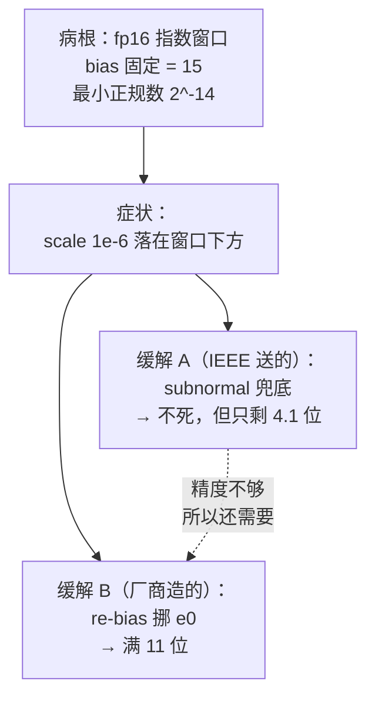

# 03 量化 scale 的表示域困境：`e0` 可配浮点的由来

> **一句话**：量化 scale 的量级常落在 $10^{-6}\sim10^{-8}$，**刚好是标准 fp16 的 subnormal 区**。
> 解法不是"加位数"，而是**把指数偏置 `e0` 变成可配参数**，让浮点窗口跟着张量的量级滑动。

---

## 0. 为什么量化必须关心"表示域"

量化公式里有两类量：

| 量 | 公式 | 量级 | 谁在用 |
|---|---|---|---|
| **整数** $q$ | $q = \mathrm{round}(x/s)$ | $-128 \sim 127$ | MAC 阵列（int8） |
| **scale** $s$ | $s = \max\lvert x\rvert / 127$ | **$10^{-6} \sim 10^{-2}$** ⚠️ | 反量化（requantize） |
| **bias** $b$ | 训练得到 | $10^{-2} \sim 10^{0}$ | 加偏置 |

整数那一路 Lesson 21/22 已经讲透了（int32 累加、multiplier + shift）。**scale 这一路很少被讨论**，但它有个很实际的问题：

$$
\max\lvert w\rvert = 10^{-4} \;\Longrightarrow\; s_w = \frac{10^{-4}}{127} \approx 7.87 \times 10^{-7}
$$

**这个数在 fp16 里已经掉进 subnormal 区了。**

而 scale 是**逐通道**的。一个通道的 scale 精度差 1%，就变成整个通道的系统性偏差——比单个权重出错严重得多。

---

## 1. 实测：标准 fp16 装 scale 的精度崩塌

fp16 的门槛（回看第 02 章）：

| | 值 |
|---|---|
| 最小正规数 | $2^{-14} = 6.1035\times10^{-5}$ |
| subnormal 间距 | $2^{-24} = 5.9605\times10^{-8}$ |

现在把不同量级的权重量化一遍，看 scale 存进 fp16 后还剩多少精度：

| $\max\lvert w\rvert$ | $s_w$ | 理想指数 $E$ | 落点 | 实存值 | **相对误差** | **有效位** |
|---|---|---|---|---|---|---|
| $10^{-1}$ | 7.8740e-04 | 4 | 正规数 | 7.872581e-04 | 0.02% | **11 bit** |
| $10^{-2}$ | 7.8740e-05 | 1 | 正规数 | 7.873774e-05 | 0.00% | **11 bit** |
| $10^{-3}$ | 7.8740e-06 | $-2$ | **subnormal** | 7.867813e-06 | 0.08% | **8 bit** |
| $10^{-4}$ | 7.8740e-07 | $-6$ | **subnormal** | 7.748604e-07 | 1.59% | **4 bit** |
| $10^{-5}$ | 7.8740e-08 | $-9$ | **subnormal** | 5.960464e-08 | **24.30%** | **1 bit** |
| $10^{-6}$ | 7.8740e-09 | $-12$ | **低于最小 subnormal** | **0.000000e+00** | **100.00%** | **0 bit** |

**两条断崖**：

1. $E$ 变成负数 → 掉进 subnormal → 精度从 11 位线性崩塌到 1 位
2. $s_w$ 低于最小 subnormal $2^{-24}$ → **直接归零**

> ⚠️ **最右边那行是最恐怖的**：$\max\lvert w\rvert = 10^{-6}$ 时，**scale 变成 0**。
> $y = s \cdot q$ 立刻全 0，**整层输出消失**，而且不报错、不 NaN，就是静默地全 0。

---

## 2. 病因诊断：不是 subnormal 的错

这里必须精确，因为很容易把因果搞反。

把同一个 $s = 10^{-6}$ 放进**三个假设世界**：

| 世界 | 机制 | $10^{-6}$ 的遭遇 | 有效位 | 相对误差 |
|---|---|---|---|---|
| **① 标准 fp16（IEEE，有 subnormal）** | 窗口 $[2^{-14}, 2^{15}]$，下面靠 subnormal 兜 | 落 subnormal，$M \approx 17$ | **4.1 bit** | **~1.3%** |
| **② 假设 fp16 没有 subnormal（FTZ）** | 低于 $2^{-14}$ 一律刷 0 | **直接变 0** | **0 bit** | **100%** |
| **③ `fp16e`（`e0=35`）** | 窗口滑到 $[2^{-34}, 2^{-5}]$ | 落**正规数** | **11 bit** | **0.02%** |

**结论**：

$$
\boxed{\text{病根} = \text{fp16 的指数窗口没对准 scale 的取值范围}}
$$

- **subnormal 不是病因**，它是"把灾难降级成精度损失"的**半个补丁**（世界 ① vs ②）
- **`fp16e` 也不是因为 subnormal 才存在**：即使世界 ②（根本没有 subnormal 这种东西），`fp16e` 照样必要
- subnormal 的作用是**让损失变成可度量的**——正因为有它，问题才表现为"11 位掉到 4.1 位"，而**挪一下窗口就能拿回那 6.9 位**

所以正确的因果链是：



---

## 3. `e0` 是什么：把指数偏置变成参数

### 3.1 回顾：标准浮点的偏置是固定的

$$
x = (-1)^s \times 2^{\,E - \color{red}{\text{bias}}} \times \left(1 + \frac{M}{2^m}\right)
$$

| 格式 | 偏置（固定） |
|---|---|
| fp32 | 127 |
| fp16 | 15 |
| bf16 | 127 |

**偏置就是那把"刻度尺的零点"**：$E$ 是无符号整数，减去偏置才得到真实指数（可正可负）。

### 3.2 `e0` 可配 = 刻度尺零点可调

私有格式 `fp16e` 只是把这个常数换成一个**可配置参数**：

$$
x = (-1)^s \times 2^{\,E - \color{red}{e_0}} \times \left(1 + \frac{M}{2^m}\right)
$$

> 📌 用户现场确认：*"`e0` 是指数位取 2 的次幂后减去这个值，比如 fp32 会再减去一个 127，这里的 `e0` 可以不必 127 了"* —— 就是这个意思。

### 3.3 ⚠️ 关键约束：窗口只能"滑"，不能"变宽"

指数字段宽度不变（5 位），所以可表示的指数跨度**永远是 $2^{30}$**：

$$
\text{窗口宽度} = 2^{\,2^{e} - 2} = 2^{30} \approx 9.03\ \text{个数量级} \quad \text{（恒定）}
$$

$e_0$ **只决定这个窗口摆在哪一段实数轴上**。实测：

| $e_0$ | $s=10^{-6}$ 的 $E$ | 合法？ | 窗口下界 | 窗口上界 | 有效位 |
|---|---|---|---|---|---|
| **15**（标准 fp16） | $-5$ | ✗ | 6.1035e-05 | 65504 | — |
| 23 | 3 | ✓ | 2.3842e-07 | 255.875 | 11 bit |
| 31 | 11 | ✓ | 9.3132e-10 | 0.999512 | 11 bit |
| **35** | 15 | ✓ | 5.8208e-11 | 0.0624695 | 11 bit ← 量级归一化到这里 |
| 45 | 25 | ✓ | 5.6843e-14 | 6.1005e-05 | 11 bit |

**"re-bias" / "滑动窗口浮点"（sliding-window floating point）** 就是这件事。

---

## 4. 收益的精确量化

实测对比：

```
--- 同一个 16 位容器，只改偏置，精度差多少 ---
  fp16  (e0=15) : 1.013279e-06   相对误差   1.33%
  fp16e (e0=35) : 1.000240e-06   相对误差   0.02%
  精度提升约 5.8 bit
```

$$
\Delta \text{bits} = \log_2 \frac{1.33\%}{0.02\%} = \log_2(54.6) \approx 5.8
$$

**同一个 16 位容器、同样的硬件、同样的乘法器，只改一个偏置常数，精度差 5.8 个 bit（约 55 倍）。**

这个数字很好记：**它正好等于"subnormal 折叠掉的那部分位数"**。账目对得上，说明推理链自洽。

---

## 5. 怎么选 `e0`：归一化原则

一条简单可用的规则 —— **把张量的量级搬到 $2^0$ 附近**：

$$
\boxed{\,e_0 = 15 - \left\lfloor \log_2 \max\lvert x\rvert \right\rfloor\,}
$$

（15 是 fp16 的默认偏置；换成别的格式就用那个格式的偏置。）

| 张量 | $\lfloor\log_2 \max\rvert x\rvert\rfloor$ | 推荐的 $e_0$ |
|---|---|---|
| $\max = 1$ | 0 | 15（= 标准 fp16） |
| $\max = 10^{-2}$ | $-7$ | 22 |
| $\max = 10^{-6}$ | $-20$ | **35** |

**说白了 $e_0$ 就是把张量"归一化到 1 附近"的那个缩放因子**（取 log2 之后）。

> 💡 由此能看出一个巧合：$e_0$ 携带的信息和量化 scale 携带的信息**几乎一样**——
> 因为 $s = \max/127$，所以 $e_0 \approx 15 - \log_2(\max/127) = 15 - \log_2 s - 7$。
> 也就是说：**`fp16s` 的"`e0`"很可能就是跟着 scale 算出来的**（这能解释它为什么叫 `s`）。

---

## 6. ⚠️ 三个必须澄清的误区

| 误区 | 正确说法 |
|---|---|
| "`e0` 可配 → 精度更高了" | ❌ re-bias **不会**让任何已经落在正规区的数多一个 bit。它的**全部**收益来自"把 subnormal 升级成正规数" |
| "subnormal 是这些私有格式的病因" | ❌ 病因是**窗口错位**。subnormal 是"降级补丁"，私有格式是"治本补丁" |
| "窗口变宽了所以能表示更大的数" | ❌ 窗口宽度**恒定** $2^{30}$。$e_0$ 只让窗口平移，**拿头部空间换脚部空间** |

### 误区 1 的具体含义

如果一个张量所有值本来就在 $[6.1\times10^{-5},\,6.55\times10^{4}]$ 里，改 $e_0$ **一点精度都不多给你**——因为这时候指数域那 5 个 bit 只要"够区分"就行，多出来的动态范围本来就是浪费的。

**真实的收益场景只有两个极端**：

1. **张量整体太小**（值域低于 $6\times10^{-5}$）→ 原本掉 subnormal → 挪窗口救回满精度
2. **张量整体太大**（值域超过 65504）→ 原本溢出成 inf → 挪窗口救回数值

---

## 7. 旁证：bias 侧根本不需要这个格式

这一条能反过来支持"动机在 scale 那一侧"，也解释了命名为什么是 `s`：

| 量 | 典型取值 | 在标准 fp16 里的位置 |
|---|---|---|
| **scale** $s_w = \max\lvert w\rvert/127$ | $10^{-6} \sim 10^{-2}$ | $10^{-2}$ 勉强正规，$10^{-6}$ **掉进 subnormal** ⚠️ |
| **bias** $b$ | $10^{-2} \sim 10^{0}$ | $2^{-6.6} \sim 2^{0}$，**完全在正规区** ✓ |

**bias 用标准 fp16 精度绰绰有余**（离 subnormal 区还有 8 个 binade 的余量）。

所以：

- `fp16s` 的**必需性 100% 来自 scale 那一侧**
- bias 被一起塞进同一个格式，更可能是因为**打包方便 / 共用同一条乘加通路**（反量化是 $y = s_w s_x \cdot q + b$，两者本来就该进同一个乘加器，**用两种格式就得多一套数据通路**），而不是它自己需要

> ⚠️ 标注：这是 **🔶 强推断**。算术上很硬，但"厂商的真实动机"只有 spec 或设计者能确认。

---

## 8. 一个必须小心的实现坑

> **`fp16e(e0=e) → 公共格式` 的重定基，必须做指数域的整数加 $(b - e)$。**

如果模拟器里漏掉这一项，数值会整体错 $2^{\Delta}$ 倍。而这类 bug 在**单张量测试里看不出来**——因为输出会被同一个错误缩放抵消，**只有跨 `e0` 混算时才暴露**。

这是最经典的 bias 相关 bug，第 04 章还会回到它（因为它是"为什么需要公共基准"的起点）。

---

## 9. 跑一下

```bash
python3 float_bits.py scale
```

自己改 `e0` 试：

```python
to_format(1e-6, 5, 10, 15)    # 1.013279e-06   相对误差 1.33%
to_format(1e-6, 5, 10, 35)    # 1.000240e-06   相对误差 0.02%
```

---

## 10. 承上启下

到这里我们有了三个关键结论：

| 结论 | 章节 |
|---|---|
| 指数位买范围、尾数位买精度 | 01 |
| 小值会掉进 subnormal，精度线性退化（FTZ 硬件直接归零） | 02 |
| **窗口错位是病根，re-bias 是解药，收益可精确量化（5.8 bit）** | 03 |

但 re-bias 带来一个新问题：

> **如果每个张量的 `e0` 都不一样，它们的指数基准就不同，还怎么做乘加？**

这直接推出一个"必须有公共基准"的结论——也就是第 04 章里 `fpin` 那个角色。
