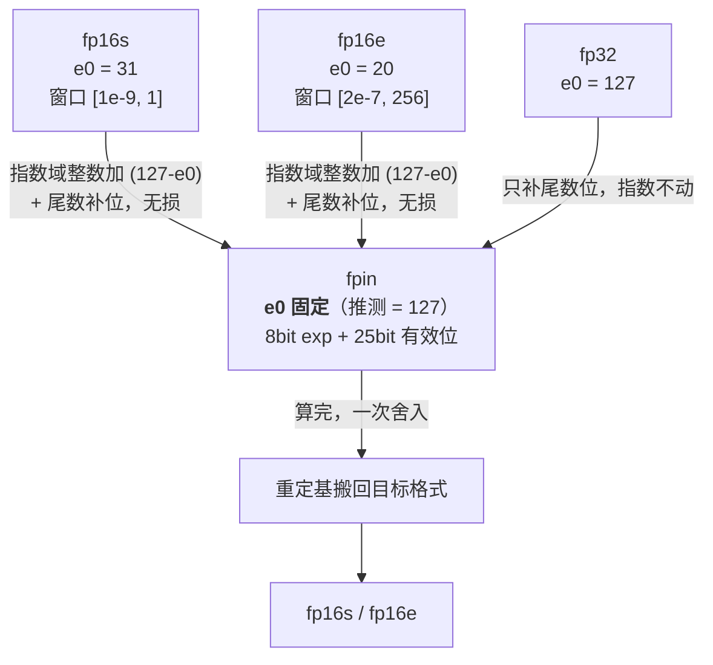

# 04 私有格式案例：`fpin` / `fp16s` / `fp16e`

> **本文是"反推"练习**：面对一个没看过 spec 的私有设计，怎么靠位域常识 + 实测把它推清楚。
>
> ⚠️ **读之前先看第 0 节的证据等级约定。** 本文混了事实和推断，二者的可信度差得很远。

---

## 0. 证据等级约定

| 标记 | 含义 | 使用建议 |
|---|---|---|
| ✅ **已确认** | 来自用户现场信息 / 本机实测 | 可直接引用 |
| 🔶 **强推断** | 算术上必然，或多条事实高度吻合 | 可对外说，但要能复述推理链 |
| ⚠️ **弱推断** | 只是"一个自洽的解释"，未验证 | **别说给别人听**，先按第 6 节去验证 |

---

## 1. 已知事实（✅）

| # | 事实 | 来源 |
|---|---|---|
| 1 | 存在三种私有浮点格式：`fpin` / `fp16s` / `fp16e` | 用户现场信息 |
| 2 | `fpin` 位宽 **33 bit**，**不暴露给客户**，只在数据通路内 | 用户现场信息 |
| 3 | 计算流程：`fp16 → fpin → 计算 → fpin → fp16` | 用户现场信息 |
| 4 | `fp16s` 与 `fp16e` 都是 **16 bit** | 用户现场信息 |
| 5 | `fp16s` 用途：存量化的 **scale 与 bias** | 用户现场信息 |
| 6 | `fp16e` 的 **`e0` 可配**，含义是指数偏置（fp32 用 127，这里不必 127） | 用户现场信息（明确确认） |

**从事实到推断的分界线就在这 6 条。** 下面全是推断。

---

## 2. `fpin`：33 位的内部累加容器

### 2.1 核心性质：能无损装下 fp32

先注意一个容易算错的点：**fp32 本身的有效位数是 24**（23 显式 + 1 隐含）。

| 格式 | 有效位（含隐含） | 指数字段 |
|---|---|---|
| fp16 | 11 | 5 bit |
| fp32 | 24 | 8 bit |
| **`fpin`（推断 `1+8+24`）** | **25** | **8 bit** |

因为 $25 > 24$ 且指数字段相同：

$$
\text{fp32} \subset \text{fpin}, \qquad \text{fp16} \subset \text{fpin} \qquad \text{（都是无损的）}
$$

**这解释了"内部使用更方便"**：不需要给 fp16 和 fp32 各准备一套累加通路，**一个容器通吃，且转换无损失**。

### 2.2 33 位的账本

$$
33 = \underbrace{1}_{\text{sign}} + \underbrace{8}_{\text{exp}} + \underbrace{24}_{\text{mantissa}}
$$

| 段 | 职务 | 推理解释 |
|---|---|---|
| **8 位指数** | 与 fp32 同域 | 累加不会溢出/下溢；区间换算变成纯截位，可复用 fp32 的对齐单元 |
| **24 位尾数（→ 25 有效位）** | ① 装得下 fp32 ② 装得下 fp16 乘积还有余量 | fp16 有效位 11，$11 \times 11$ 乘积最多 **22 bit**，25 位给到 **22 + 3** 位余量 |
| **1 位符号** | 常规 | — |

> 📌 **注意**："24 位尾数承接 int8 点积"这个说法**是错的**（我一开始就这么推的）。
> 因为 `fpin` 的入口是 **fp16**，不是 int8。真正的依据是 **fp16 乘积 22 bit**。
> 24 这个数字对 int8（15 位）和 fp16（22 位）都够宽，属于**巧合**，不能用来反推用途。

### 2.3 ⚠️ 一个我无法确定的点：为什么是 33 而不是 32

如果 `fpin` 是 32 位（`1+8+23`，24 有效位），它**已经能无损装下 fp32**，也能装下 fp16 的 22 位乘积（还剩 2 位余量）。

**所以多出来的那 1 位，动机一定是"为累加"，但具体是哪一种，我无法从现有信息判定：**

| 候选解释 | 内容 | 怎么验证 |
|---|---|---|
| **(a) 加宽尾数** | `1+8+24` → 25 有效位，给 22 位乘积留 3 位余量 | 查位域定义 |
| **(b) 独立的进位/保护位** | `1+8+23+1`：32 位数据 + 1 位 adder guard bit | 查第 33 位是否参与运算，还是只做溢出标志 |
| **(c) 字节/寻址对齐** | 24 位尾数 = 3 字节整齐 | 查搬运代码是否按字节拼装 |

> **这条必须问同事或查 spec 才能定。** 如果是 (b)，那"33 位"这个说法在口语上成立，但格式本体其实是 32 位 + 1 个标志位。

**顺带撤回一个我早期的错误判断**：我说过"33 不是 2 的幂，存储/寻址不友好，所以可疑"。
→ **这条作废。** 既然 `fpin` 从不落内存、不进 ABI、不出现在图 IR 里，这个宽度**只花 ALU/寄存器面积，不花带宽、不受打包约束**。设计者没有理由把它凑成 32。

### 2.4 为什么真的需要更宽的容器（🔶 强推断，含实测）

`fp16 → fpin → 算 → fp16` 的语义是：**加宽 → 算完 → 只在最后舍入一次**。这不是锦上添花，是 fp16 累加**不做就废**的地方。

#### (1) 吸收阈值：大数吃掉小数

1.0 上面加一个微小量，看能否改变结果（实测）：

| 加数 | fp16 生效？ | 25 位容器生效？ |
|---|---|---|
| $2^{-9}$ | ✓ | ✓ |
| $2^{-10}$ | ✓ ← **fp16 阈值** | ✓ |
| $2^{-11}$ | ✗ | ✓ |
| $\vdots$ | ✗ | ✓ |
| $2^{-24}$ | ✗ | ✓ ← **容器阈值** |
| $2^{-25}$ | ✗ | ✗ |

$$
\boxed{\text{抗吸收余量放大 } 2^{14} = 16384 \text{ 倍}}
$$

#### (2) 长累加：加 K 个 1.0

| $K$ | fp16 顺序加 | 25 位容器 | 精确值 | fp16 误差 |
|---|---|---|---|---|
| 1,000 | 1000 | 1000 | 1000 | 0.00% |
| **10,000** | **2048** ⚠️ | 10000 | 10000 | **79.52%** |
| **70,000** | **2048** ⚠️ | 70000 | 70000 | **97.07%** |

**fp16 在 2048 附近就停住了。** 而且这**不是溢出**（fp16 上限 65504）——是**吸收**：

> 和到 2048 时，ulps 是 2；再加 1.0 正好是半个 ulp，被 round-half-even 丢掉。

#### (3) 更真实的点积（K 项，量级跨 6 个数量级）

| $K$ | fp16 累加偏差 | 25 位容器偏差 | 改善倍数 |
|---|---|---|---|
| 64 | 1.225e-04 | 2.399e-08 | **5,105×** |
| 256 | 2.676e-03 | 6.555e-08 | **40,829×** |
| 1024 | 2.417e-04 | 1.081e-07 | **2,237×** |
| 4096 | 1.348e-02 | 3.917e-08 | **344,195×** |

> **诚实的边界**：加宽容器**不是零误差**。指数差超过 25 位时一样会舍入，
> 只是阈值抬高了、且"**每步都舍**"变成"**少数几步才舍**"。

**同类参考系**（可以拿去和同事对齐）：

| 设计 | 做法 |
|---|---|
| NVIDIA Tensor Core | fp16/bf16 乘 → **fp32 累加** |
| TPU | bf16 乘 → fp32 累加 |
| TI C6000 DSP | 32 位乘 → **40 位累加器**（多出 8 位 guard bits） |
| **`fpin`** | 推测 = 比 fp32 还宽 1 位的累加容器 |

---

## 3. `fp16s` / `fp16e`：re-bias 的两个档

第 03 章已经推完原理，这里只做定位。

| 格式 | $e_0$ | 定位 | 依据 |
|---|---|---|---|
| `fp16s` | 固定（专用值） | **为 scale 特化**的 re-bias 预设 | ✅ 用户确认用途就是存 scale/bias |
| `fp16e` | **可配** | 通用的 re-bias 版 | ✅ 用户确认 `e0` 可配 |

### 🔶 推断：两者可能只是同一个格式的两个预设

理由：`e0` 是同一个硬件字段（指数偏置），`fp16s` 是"偏置锁死到 scale 专用值"的特化预设，`fp16e` 是"偏置自由"的通用版。

**实测支持**：$s = 10^{-6}$ 这类 scale 需要的 `e0` 约在 **31~35**（第 03 章的表），而 $e_0 = 31$ 给出的窗口是 $[9.3\times10^{-10},\,1.0]$ —— **上限正好落在 1.0，几乎就是 scale 的取值域，一点不浪费**。

所以猜测：**`fp16s` ≈ `fp16e` 取 $e_0 \approx 31$ 的预设**。

> ⚠️ 如果这条成立，那"三种格式"实际上是"**两种机制 + 一个特化预设**"。你的记忆在**格式数量**上可能略有高估。

### 🔶 命名佐证

`e0` 携带的信息和 scale 携带的信息**几乎等价**（第 03 章第 5 节）：

$$
e_0 = 15 - \log_2 \max\lvert x\rvert = 15 - \log_2(127\,s) \approx 8 - \log_2 s
$$

**`e0` 就是 scale 的对数**。所以 `fp16s` 里的 `s` 可能不只是"用于 scale"，而是"**偏置由 scale 决定**"（self-biased）。

> 顺带排除一种可能：`s` 若解读为 **signed**，对浮点格式毫无意义（浮点天生有符号位）→ 所以 `s` 更可能是 **scale** 或 **storage/static**。

---

## 4. 🔶 闭环论证：为什么必须有"固定偏置的公共基准"

这条是本文最有价值的推论，它把三个格式串成了一个**没有冗余**的体系。

### 问题

如果 `fp16s` / `fp16e` 的 $e_0$ **可以各张量不同**，就出现一个硬问题：

> **权重张量的 $e_0 = 31$、激活张量的 $e_0 = 20$，它们的"指数 $E=5$"根本不是一个意思，不能直接相乘。**

做 MAC 必须先把两者**对齐到同一个偏置基准**。

### 结论

**"对齐"需要一个公共基准，而 `fpin` 就是这个基准**（它的偏置固定，大概率 = 127 = fp32 的偏置）。

于是三者的关系变得**没有一个是多余的**：

| 格式 | $e_0$ | 为什么必须存在 |
|---|---|---|
| `fp16s` / `fp16e` | **可变** | **存储用**：每个张量自己滑窗口，换有效精度 |
| **`fpin`** | **固定**（推测 = 127） | **计算用**：唯一能让不同偏置的操作数**汇合**的公共货币 |

**这也反向解释了"`fpin` 不暴露给客户"**：它不是数据格式，它是**内部公共基准**。客户看它没有意义——把 `fpin` 存盘再读回来，只会暴露硬件实现细节。

### 硬件代价（顺便看出"方便"在哪）

| 动作 | 代价 |
|---|---|
| `fp16e(e0=A)` → `fpin` | 指数域**整数加** $(127 - A)$ + 尾数补位。一条加法 |
| 两个不同 $e_0$ 相加 | 先对齐基准（或在 `fpin` 里做，反正指数域够宽） |
| $e_0$ 改 $\Delta$ | 数值整体乘 $2^{\Delta}$ → **纯移位**（这正是块浮点那种"移位当乘法"红利的来源） |
| $e_0$ 的存放 | **必须作为元数据跟张量走**，否则数据无法解码 |

---

## 5. 动机总结：为什么不直接用 fp32

| 方案 | 优点 | 缺点 |
|---|---|---|
| 全程 fp32 | 简单、范围大 | **尾数 24 位不够承接 22 位 fp16 乘积后长累加**；且面积/功耗更大 |
| 全程 fp16 | 省面积 | 累加会**吸收**（第 2.4 节：10000 个 1.0 加成 2048）；溢出上限仅 65504 |
| **`fpin` 33 bit** | 无损承接所有输入格式 + 零舍入累加 + 出口只舍一次 | 数据通路宽 1~2 bit（**不落内存，所以不花带宽**） |

**一句话**：`fpin` 是"**只花 ALU 面积、不花带宽**"的精度保险——因为它是内部格式，宽度的代价被限制在寄存器/ALU 里。

---

## 6. ⚠️ 待确认清单（本文最实用的部分）

按"性价比"排序 —— 前 3 条都能自己查，且信息量最大。

| # | 问题 | 为什么重要 | 怎么查 |
|---|---|---|---|
| **1** | **`fpin` 的位域到底是 `1+8+24` 还是 `1+8+23+1`？** | 决定第 33 位是数据位还是标志位 | 模拟器源码里找 `cvt_fpin` 之类的位操作；**读代码比问人快** |
| **2** | **模拟器的 `fpin` 模拟粒度**：整算子一次往返，还是每次 MAC / 每个部分和都往返？内部用 `float` / `double` / 整数宽位？ | **不对齐 → 模拟器精度高于硬件 → 校准出的 scale 不一定能迁移到板子** | 读模拟器实现 |
| **3** | **subnormal 策略**：模拟器和板子各是 IEEE 还是 FTZ？ | scale 若归零，整层输出全废（第 02 章） | 查编译选项（`-ffast-math` 常开 FTZ）+ 实测 $10^{-7}$ 能否往返 |
| 4 | `e0` 的**粒度**（per-tensor / per-channel / per-block）与**存放位置** | 决定硬件要不要做动态重定基 | 查图节点属性 / 张量元数据 |
| 5 | `e0` 是**编译期定死**还是**运行期可改**？ | 决定要不要动态重定基通路 | 查 API |
| 6 | `fp16s` 是不是**就是 $e_0 \approx 31$ 的 `fp16e` 预设**？ | 决定是"三种格式"还是"两种 + 一个预设" | 对照两者位域定义 |
| 7 | 模拟器 `fp16e → fpin` 的**重定基有没有做** $(127 - e_0)$ 那一步？ | 漏掉会整体错 $2^{\Delta}$ 倍，**单张量测试看不出来**，只有跨 `e0` 混算才暴露 | 用两个 $e_0$ 不同的张量做张量乘，看是否错 $2^{\Delta}$ |

### 一个五分钟可做的验证实验（⭐ 强烈推荐）

**在模拟器里对比同一个点积的三条路径**：

1. `fpin` 路径（`fp16 → fpin → 累加 → fp16`）
2. 精确路径（`float64`）
3. 朴素路径（逐项 fp16 加）

预期：**(1) 应该贴着 (2)，误差约 1 个 fp16 ulp；(3) 会明显漂移**（本课实测偏差可达 1%~2%，第 2.4 节）。

**如果 (1) 和 (3) 差不多**，说明模拟器的 `fpin` 模拟粒度有问题（可能是每次 MAC 都往返，或者内部用了 fp16 而不是宽容器）。

---

## 7. ⚠️ 我在这个推理过程中的判断变化记录

保留这一节是为了**防止你把推断当成事实**，也防止你重复我走过的弯路。

| 我说过 | 状态 | 原因 |
|---|---|---|
| "24 位尾数让 int8 点积精确累加" | ❌ **作废** | `fpin` 的入口是 **fp16**（22 位乘积），不是 int8 |
| "33 不是 2 的幂，存储/寻址不便，所以可疑" | ❌ **作废** | `fpin` 不落内存，宽度不花带宽 |
| "33 位没有公开先例" | ⚠️ **转为支持** | "奇怪宽度 + 不暴露"是自洽组合 |
| "块浮点文献里 $e_0$ 惯用块共享指数" | ❌ **失效** | 用户确认 `e0` 就是普通指数偏置 |
| 读法 B：$e_0$ = 块共享指数（15 位尾数的 BFP） | ❌ **被否掉** | 同上 |
| 读法 A：$e_0$ = 可配指数偏置（滑动窗口） | ✅ **确认** | 用户现场确认 |
| `fp16s` / `fp16e` 是同一格式的两个偏置预设 | 🔶 **高度吻合** | $e_0=31$ 的窗口正好是 scale 域 |
| `fpin` 必须有**固定**偏置才能做公共基准 | 🔶 **新推论** | 逻辑很硬，待确认 |
| `fp16s` 的存在是"subnormal 的直接产物" | ⚠️ **表述已修正** | 病因是**窗口错位**；subnormal 是症状/半个补丁（第 03 章第 2 节） |

**方法论教训**：一个自洽的故事**不等于**事实。第 04 章这种"只有一个信息源、无法交叉验证"的场景，**必须把推断和事实分开标**，否则会给后续决策带来假的确定性。

---

## 8. 面试可利用点

这套东西在面试里很好用，因为它是**从硬件数值格式角度讲"为什么要自己造类型"**，比空谈"浮点动态范围大"具体得多。

| 可以用的具体数字 | 说明 |
|---|---|
| **`2048`** | fp16 累加 10000 个 1.0 只得到 2048（吸收，不是溢出） |
| **`2^14 = 16384`** | 加宽容器把抗吸收余量放大这么多倍 |
| **`5.8 bit`** | 只改指数偏置常数，同一个 16 位容器精度提升 5.8 位 |
| **`10^{-6}` 在 fp16 里只剩 4.1 位有效位** | 说明"位数不够"和"窗口没对准"是两回事 |
| **`22 bit`** | fp16 × fp16 的精确乘积宽度（$11 \times 11$）—— 推导累加器宽度的起点 |
| **TI C6000 的 40 位累加器** | 说明"累加器比操作数宽"是 DSP 的老套路，不是 AI 芯片的发明 |

**一个可以主动抛出的观点**：

> "数据格式的取舍不只是'选几位'，还有'窗口摆在哪'。同样的 16 位，改一下指数偏置就能把某个量级的精度提 5 个 bit——**所以在边缘部署里，看到一个 scale 精度不够，第一反应不该是加位宽，而是看表示域对不对**。"

---

## 9. 一句话总结

| 角色 | 格式 | 偏置 | 职责 |
|---|---|---|---|
| **存储** | `fp16s` / `fp16e` | **可变**（`e0` 可配） | 各张量自己滑窗口，换有效精度 |
| **计算** | `fpin`（33 bit） | **固定**（推测 = 127） | 所有"不同偏置"的汇合点；宽 1~2 bit 只花 ALU，不花带宽 |
| **共同的设计律** | — | — | **累加器精度 > 操作数精度** |
