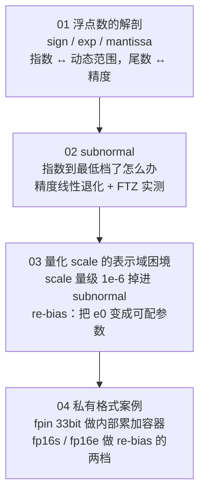

# Lesson 25：浮点格式与私有数据格式

> **切入点：float。**
> 这一课不是"浮点数入门"，而是从 **float 的位域结构**出发，一路推到
> **"为什么芯片厂商要自己造 float"** —— 也就是工作里会遇到的 `fpin` / `fp16s` / `fp16e` 那类东西。

---

## 一、为什么单独开这一课

起因是一次真实的疑问：同事说芯片内部有三种私有的浮点格式，一种叫 `fpin`（33bit，给 NPU 内部算）、一种叫 `fp16s`（16bit，专门存量化的 scale/bias）、一种叫 `fp16e`（16bit，指数偏置 `e0` 可配）。

这三个名字背后其实是一条**完整的设计链**：

$$
\text{位域结构} \;\to\; \text{subnormal} \;\to\; \text{量化 scale 的表示域} \;\to\; \text{re-bias} \;\to\; \text{私有格式}
$$

把这链条走通，能一次补上三块东西：

| 补什么 | 具体收获 |
|---|---|
| **量化理论的"表示域"那一半** | Lesson 21 讲的是 `scale/zero_point` 怎么算（公式侧），这一课讲的是**这些 scale 用什么格式存得下**（表示侧）。两边合起来才完整 |
| **数据格式选型的判断力** | 能回答"为什么量化 scale 不用 fp16 存""为什么累加器要比操作数宽""FP8 该选 E4M3 还是 E5M2" |
| **看懂厂商私有设计的眼力** | 私有格式不是玄学，都是"位域 + 偏置"的排列组合。学会反推就能读懂 spec |

**另一个更实际的收获**：`subnormal` 是**模拟器与硬件结果不一致**的经典来源。做量化部署时，如果你的校准跑在软件模拟器上，这条链直接决定了"校准出来的 scale 能不能迁移到板子"。

---

## 二、这一课在课程里的位置

| 课程 | 视角 | 和本课的关系 |
|---|---|---|
| **Lesson 13–20**（TVM / MNN） | 编译与算子 | 那些是"怎么算"，本课是"数据长什么样" |
| **Lesson 21**（量化原理与误差分析） | **公式侧** | `scale/zero_point/requantize` 的数学；本课接在它后面，管"表示域" |
| **Lesson 22**（MNN 量化部署） | 工程侧 | 真机上跑 int8 推理；本课的 FTZ 风险在那条链上会实际碰到 |
| **Lesson 24**（推理工程） | 云侧格式 | 06 章讲 FP8/MXFP8/NVFP4 的**格式谱系**；本课往下钻一层，讲**位域怎么排** |

一句话分工：**Lesson 24 告诉你有哪些格式，本课告诉你为什么它们长这样。**

---

## 三、章节导航

| 章节 | 一句话 | 难度 |
|---|---|---|
| [01 浮点数的解剖](01_浮点数的解剖.md) | 三段式位域 + 解码公式；**指数买动态范围，尾数买精度**；inf/NaN/subnormal 完整码位分配 + 为什么这些约定是**人为的** | ⭐ |
| [02 subnormal 与渐进下溢](02_subnormal与渐进下溢.md) | 指数档位用光了，借尾数位继续往下表示；代价是精度线性退化；**含编译选项实测 + FTZ 探针** | ⭐⭐ |
| [03 量化 scale 的表示域困境](03_量化scale的表示域困境.md) | 为什么标准 fp16 装不了量化 scale，`e0` 可配怎么救 | ⭐⭐⭐ |
| [04 私有格式案例：fpin / fp16s / fp16e](04_私有格式案例.md) | 反推三种私有格式的设计动机；**含事实/推断分离与待查清单** | ⭐⭐⭐⭐ |



---

## 四、配套脚本

`float_bits.py` 用**纯标准库**自己实现了 IEEE754 风格的编解码，所以可以任意改 `指数位 / 尾数位 / 偏置` —— 这是观察私有格式原理的关键（NumPy 给不了这个自由度）。

```bash
python3 float_bits.py anatomy      # 拆位域，核对解码公式
python3 float_bits.py subnormal    # subnormal 边界、精度退化表、FTZ 模拟
python3 float_bits.py scale        # 量化 scale 在 fp16 / fp16e 下的精度对比
python3 float_bits.py accumulate   # fp16 累加 vs 加宽容器 vs 精确值
python3 float_bits.py all          # 全部（输出存档在 实测输出.txt）
```

**修改偏置只要改一个数字**，就能自己复现 `fp16e` 的效果：

```python
FORMATS["fp16"] = (5, 10, 15)      # 标准 fp16
# 改成 e0 = 35，就是"窗口滑到 1e-6 量级"的私有格式
to_format(1e-6, 5, 10, 35)         # 相对误差 0.02%（标准 fp16 是 1.33%）
```

**脚本输出已验证**，文档里的所有数字都来自 `实测输出.txt`，不是抄来的。

### 还有一个 C 探针：`ftz_probe.c`

`float_bits.py` 是**算法模型**（模拟 IEEE754 的数学行为）；`ftz_probe.c` 是**真实环境探针**（实测你的编译器和 CPU 到底怎么处理 subnormal）。

```bash
gcc -O2 ftz_probe.c -o probe && ./probe            # 基线
gcc -O2 -ffast-math ftz_probe.c -o p2 && ./p2      # 看 FTZ/DAZ 被打开
./p2 --ieee                                        # 运行时强制恢复 IEEE 模式
```

它会打印 **MXCSR（x86）或 FPCR（AArch64）** 的 FTZ/DAZ/FZ 位，以及 subnormal 是否被刷零。
用法和实测结果见 **[02 章第 7 节](02_subnormal与渐进下溢.md)**。

---

## 五、⚠️ 证据等级约定（本课特别重要）

第 04 章涉及**反推一个没看过 spec 的私有格式**，所以全文用三种标记区分"哪些是事实、哪些是我猜的"：

| 标记 | 含义 | 该怎么用 |
|---|---|---|
| ✅ **已确认** | 来自你的现场信息、公开标准、或本机实测 | 可以直接引用 |
| 🔶 **强推断** | 算术上必然，或与多个事实高度吻合 | 可以对外说，但要能复述推理链 |
| ⚠️ **弱推断** | 只是"一个自洽的解释"，未经验证 | **不要说给别人听**，先按第 04 章的清单去验证 |

> 为什么要这么较真：**"存在一个自洽的解释"不等于"这就是事实"。**
> 私有格式的真实动机只有 spec 或设计者知道；本课的价值在于给出**可验证的推理**，而不是给出结论。

---

## 六、学完应该能回答的问题

1. 一个浮点格式的**动态范围**和**精度**分别由哪几位决定？为什么不能同时最优？
2. `subnormal` 是什么？为什么 fp32 也有？它买到什么、付出什么？**需要专门开编译选项吗？**
3. 量化 scale 为什么**不能直接用 fp16 存**？给出具体数字。
4. `e0` 可配的浮点格式（`fp16e` / `fp16s`）原理是什么？收益能精确算出来吗？
5. 为什么累加器必须比操作数宽？（用 `2048` 这个数字解释）
6. 为什么不同 `e0` 的操作数不能直接相乘，需要什么"公共基准"？
7. `E` 全 0 / 全 1 的分工是数学必然还是人为约定？举一个标准里不这么干的例子。
8. ⚠️ subnormal 在什么情况下会失效？怎么在自己的环境里查出来？
9. ⚠️ 如果你的模拟器和板子结果不一致，最该先查哪几件事？

---

## 七、延伸阅读

| 主题 | 出处 |
|---|---|
| 格式谱系（FP8/MXFP8/NVFP4 与 granularity） | 本仓库 `lesson-24-推理工程/06_量化_动态范围与粒度.md` |
| 量化公式（scale/zero_point/requantize） | 本仓库 `lesson-21-量化原理与误差分析/` |
| IEEE754-2019 标准 | <https://ieeexplore.ieee.org/document/8766229> |
| "What Every Computer Scientist Should Know About Floating-Point Arithmetic" | David Goldberg, ACM Computing Surveys 1991（经典，讲清 subnormal 的意义） |
| BFloat16 数值特性 | <https://arxiv.org/abs/1905.12334> |
