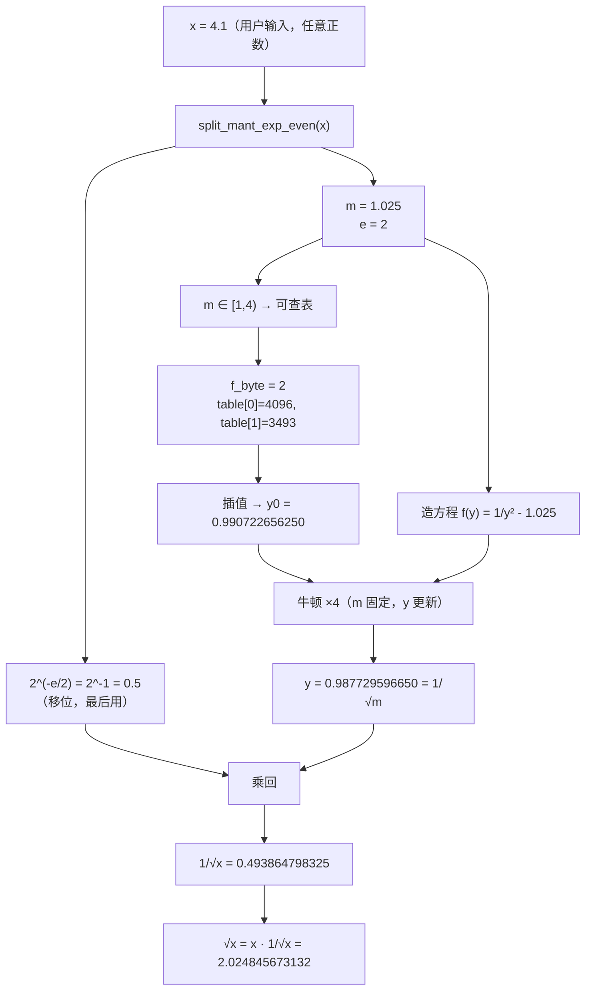

# 查表法算 exp —— 公式推导链

> 目标：在无 FPU 的硬件上，用「移位 + 查表 + 插值」算出 $e^x$。
> 全程只用 3 个常数：`LOG2E`、表（9 个 int16）、`Q=12`。

---

## 一句话总览

$$e^{x}=2^{n}\cdot 2^{f}\quad\Longrightarrow\quad \begin{cases}2^{n}\ \to\ \text{移位（免费）}\\[2pt]2^{f}\ \to\ \text{查表 + 插值（唯一要算的）}\end{cases}$$

---

## 步骤 1：换底

$$e^{x}=2^{\,x\,\log_2 e}$$

设 $t=x\log_2 e$，把底从 $e$ 换成 $2$。目的：$2$ 的整数次幂在二进制里就是移位。

> $\log_2 e \approx 1.4427$，是固定常数（代码里的 `LOG2E`）。

---

## 步骤 2：拆整数 + 小数

$$t=n+f,\qquad n=\lfloor t\rfloor,\qquad f=t-n\in[0,1)$$

- $n$：整数部分，管「移几位」
- $f$：纯小数，永远落在 $[0,1)$ 这一格，管「查哪格表」

由幂的运算法则 $2^{n+f}=2^{n}\cdot2^{f}$，于是

$$e^{x}=2^{n}\cdot 2^{f}$$

> 负数要用 floor（向 −∞ 取整），不能用向零截断，否则 $f$ 会变负、出界。
> 例：$t=-2.45 \Rightarrow n=-3,\ f=0.55$（不是 $n=-2,\ f=-0.45$）。

---

## 步骤 3：f 定点化成 8bit

$$f\_byte=\text{round}(f\times256)\in\{0,1,\dots,255\}$$

把 $[0,1)$ 放大到 $[0,256)$ 的整数，供后面按位拆分。

---

## 步骤 4：8bit 拆成「段号 + 段内位置」

$$idx=f\_byte\gg5,\qquad frac=f\_byte\;\&\;31$$

- $idx$：高 3 位（0~7）→ 落在 8 段中的哪一段
- $frac$：低 5 位（0~31）→ 段内 32 级中的哪一级

一次右移 + 一次掩码，无除法。

---

## 步骤 5：表项（离线算好，不在板上算）

$$\text{table}[k]=\text{round}\!\big(2^{\,k/8}\cdot 2^{Q}\big),\qquad k=0,1,\dots,8$$

把 $[0,1)$ 均匀切 8 段，取 9 个端点 $k/8$，在端点处放**真值**（PC 上用浮点算），
乘 $2^{Q}$ 定点化后四舍五入。$Q=12$ 时：

$$4096,\ 4467,\ 4871,\ 5312,\ 5793,\ 6317,\ 6889,\ 7512,\ 8192$$

### Q 是什么（定点标尺）

板上没有浮点，只有整数。约定：**所有带小数的实数，都先乘 $2^{Q}$ 存整数，用的时候再除回去**。
Q=12 就是"值 = 真值 × 4096"。

- 表项 `4467` 的真值其实是 $4467/4096=1.0905$，但板上只存 `4467`
- Q 越大 → 精度越高，但同一个整数能表示的最大数越小

### Q 从哪来（三条约束）

| 约束 | 要求 | Q=12 的结果 |
|---|---|---|
| 装得下 int16 | 最大表项 $2\times2^{Q}\le32768$ → $Q\le14$ | 最大 8192 ✓ |
| 够准 | 舍入误差 $\le0.5/2^{Q}$ | ≈1.2e-4 ✓ |
| 好移位 | $2^{Q}$ 得是 2 的幂，才能用 `>>Q` 代替除法 | 4096=2¹² ✓ |

### Q 和谁保持一致（全系统同一把尺）

Q 是**全局约定**，表项、插值结果、移位还原后的 $e$ 值，必须全是同一个 Q 标尺，
否则加法和比较会直接错：

```
表项 table[k]   = 真值 × 2^12
插值结果 2^f    = 真值 × 2^12
e 值(还原后)    = 真值 × 2^12
```

注意：插值权重 `frac`、`(32-frac)` 是**无量纲计数**（0~32），**不带 Q 标尺**。
所以 `lo*(32-frac)+hi*frac` 仍是 Q12，`>>5` 是插值的除以 32（不是除以 4096），标尺不变。

### Q 用在哪里（进/出门）

只有**两头显式用 Q**，中间全靠"继承"自动保持：

| 步骤 | 用 Q 的方式 | 代码/公式 |
|---|---|---|
| 建表（步骤5） | **×2^Q** 进定点世界 | `round(2^(k/8) · 2^Q)` = `(1 << q)` |
| 插值（步骤6） | 隐式保持（不写出来） | `lo*(32-frac)+hi*frac`，除 32 不是除 4096 |
| 移位（步骤7） | 隐式保持（不写出来） | `>>n` 只动 $2^n$，不动标尺 |
| 读回真值（对拍时） | **÷2^Q** 出定点世界 | `4593 / 4096 = 1.1213` |

一句话：**乘 $2^Q$ 进定点，中间全程整数运算保持标尺，除 $2^Q$ 出定点**。
中间步骤之所以不写 4096，是因为只要第一步把数造好，后面的"同标尺加减"和"移位"天然不改变 Q。

### 建表三步模板（任何函数通用）

拿到任意函数 $f(x)$，要在区间 $[a,b)$ 上建表，三步走：

| 步 | 做什么 | 公式 |
|---|---|---|
| ① | 定三参数 | 函数 $f$、区间 $[a,b)$、段数 $segs$ |
| ② | 算采样点 | $x_k = a + \dfrac{k}{segs}(b-a)$，k=0..segs（共 segs+1 个端点）|
| ③ | 采样 + 定点化 | $\text{table}[k] = \text{round}\!\big(f(x_k)\cdot 2^{Q}\big)$ |

代码模板（展开写法，三步对应三行）：

```python
table = []
for k in range(segs + 1):            # k = 0..segs，共 segs+1 个端点
    x_k = a + k / segs * (b - a)      # ① 采样点
    y   = f(x_k)                      # ② 函数值
    table.append(round(y * (1 << Q)))  # ③ 定点化：×2^Q 四舍五入
```

各函数的建表都是这个模板的实例（只换"函数"和"采样点"两处）：

```python
exp:     round(2**(k/8)   * 4096)   # f=2^x,  [0,1)
sigmoid: round(σ(k*1)     * 4096)   # f=σ,    [0,8], 步长 8/8=1
tanh:    round(tanh(k*0.5) * 4096)  # f=tanh, [0,4], 步长 4/8=0.5
倒数:    round(1/(1+k/8)  * 4096)   # f=1/x,  [1,2), 起点偏移 +1
```

注意采样点起点的差异：区间从 0 开始时 $x_k=k·步长$；区间从 1 开始（倒数表）时 $x_k=1+k·步长$。

---

## 步骤 6：线性插值（LERP）—— 核心公式

$$2^{f}\;\approx\;\frac{\text{table}[idx]\cdot(32-frac)+\text{table}[idx+1]\cdot frac}{32}$$

两端点加权平均：$frac$ 越大，结果越靠近右端点 $\text{table}[idx+1]$。

- 两个权重 $(32-frac)$ 与 $frac$ 之和恒为 $32$（归一化）
- 分子两项都是「表项（Q12）× 纯整数权重」，结果仍是 Q12
- 除以 $32=2^{5}$ 就是右移 5 位

### 插值 = 两点式（对应 y=kx+b）

这本质是过两点 $(x_0,y_0)$、$(x_1,y_1)$ 的直线。代码把段起点平移到原点，于是：

| 两点式符号 | 代码变量 | 含义 |
|---|---|---|
| $y_0$ | `lo` | 左端点函数值 |
| $y_1$ | `hi` | 右端点函数值 |
| $x-x_0$ | `frac` | **段内相对偏移**（0~31），不是绝对 x |
| $x_1-x_0$ | `n` = 32 | **段宽**（均匀 8 段，每段 32 级，常量）|
| $x_1-x$ | `n - frac` | 到右端点的距离 |

即 $y=\dfrac{lo\cdot(n-frac)+hi\cdot frac}{n}$。

**为什么不用 y=kx+b？** 斜截式要先算斜率 $k=\frac{hi-lo}{n}$，k 是带小数（如 12.625），
还要额外定点化；而两点式直接用两个 Q12 端点值，绕开斜率，代价只是多一次乘法。
数学同一条直线，工程选"不用算 k"的写法。

---

## 步骤 7：乘回 $2^n$（移位还原）

$$e^{x}=2^{n}\cdot2^{f}\;\approx\;2^{n}\times(\text{步骤 6 的插值结果})$$

Q12 域里 $2^{n}$ = 把插值结果左移 $n$ 位（$n\ge0$）或右移 $-n$ 位（$n<0$）。

---

## 总公式（一步到位）

$$e^{x}\;\approx\;2^{\,n}\cdot\frac{\text{table}[idx]\cdot(32-frac)+\text{table}[idx+1]\cdot frac}{32}$$

其中

$$
n=\lfloor x\log_2 e\rfloor,\qquad
f\_byte=\text{round}\!\big((x\log_2 e-n)\times256\big),\qquad
\begin{cases}
idx=f\_byte\gg5\\[2pt]
frac=f\_byte\;\&\;31
\end{cases}
$$

---

## 完整示例：x = 1.5

```
t    = 1.5 × 1.4427  = 2.1640
n    = floor(2.1640) = 2
f    = 0.1640
f_byte = round(0.1640 × 256) = 42
idx    = 42 >> 5 = 1
frac   = 42 & 31 = 10
table[1] = 4467, table[2] = 4871

2^f ≈ (4467 × 22 + 4871 × 10) / 32 = 146984 / 32 = 4593  (Q12)

e^1.5 = 2^2 × 2^f ≈ 4 × (4593 / 4096) = 4.4854
真值 e^1.5 = 4.4817，误差 0.08%
```

### 别搞混：板上拿着的数，一直是"真值 × 4096"

| 步骤 | 真值（数学世界） | 板上实际存的数（Q12） |
|---|---|---|
| 查表插值 | $2^{0.164}=1.1213$ | **4593** |
| 移位 ×$2^2$ | ×4 → 4.4854 | 4593 << 2 = **18372** |
| "得到 e^x" | $e^{1.5}=4.4854$ | **18372**（= 4.4854 × 4096）|

所以"得到 e^x"那一刻，板上拿着的其实是 **18372**，不是 4.4854。
Q 从建表乘进去后一直潜伏，只有最后 ÷4096 才变回真值：

```
18372 ÷ 4096 = 4.4854   ← Q 在这里才被除掉（如果下游还是定点流水，就不除，继续带着）
```

---

## 附：9 项表 vs SIMD 对齐（工程权衡）

9 个 int16 = 18 字节 = 144 bit，不是 128/256 的整数倍，塞不进一个向量寄存器。
但这个顾虑通常**不成立**，原因：

1. **表该待的地方是 L1 cache / 片上 SRAM，不是向量寄存器**。18 字节必然落在一行
   cache 内，访问零 miss；T41 场景是 DMA 一次搬进片上 SRAM 常驻。
2. **这个算法 SIMD 化的真正瓶颈是"逐 lane 查表"（gather）**，与表长是否对齐无关。
   每个 lane 按自己的 idx 取不同表项，x86 要 `vpgatherd`、NEON 要 `vtbl`，都很慢。
3. 真要 SIMD，**pad 到 16 项**即可（多余项填 0/重复 table[8]），表 18→32 字节，代价可忽略。

**背后的 tradeoff**（这是值得记住的点）：

| 方案 | 存储 | 计算 | SIMD 查表 |
|---|---|---|---|
| 9 端点 + 插值 | 18 字节（省 28 倍）| 多 2 次乘加 | 需 gather，较难 |
| 256 项全表 | 512 字节 | 纯查表 | 可用 `pshufb`/`vpgatherd` 一把梭 |

选谁取决于硬件是"存储贵"还是"ALU 贵"：T41 存储按字节抠 → 选 9 端点插值；
cache 大、ALU 忙的通用 CPU → 可能反过来选全表。这是"用 ALU 换存储"的另一面。

---

## 附：牛顿迭代求倒数（step8 的核心公式）

### 目标

求 $y=\dfrac1m$，但除法贵。把它变成"找方程根"：

$$f(y)=\frac1y - m = 0$$

只要找到让 $f(y)=0$ 的 $y$，它就是 $\dfrac1m$。

### 牛顿法代入

牛顿法通式：$y_{n+1}=y_n-\dfrac{f(y_n)}{f'(y_n)}$。

代入 $f(y)=\dfrac1y-m$，$f'(y)=-\dfrac1{y^2}$：

$$
\begin{aligned}
y_{n+1} &= y_n - \frac{\frac1{y_n}-m}{-\frac1{y_n^2}} \\
        &= y_n + \left(\frac1{y_n}-m\right)y_n^2 \\
        &= 2y_n - m\,y_n^2 \\
        &= y_n\,(2 - m\,y_n)
\end{aligned}
$$

**结果**：$y_{n+1}=y_n(2-m\,y_n)$ —— 只含乘法和减法，**除法被代数约掉了**。
这就是"用乘法算倒数"的由来（代码里 `y = y * (2.0 - m*y)`）。

### 除法是怎么"约掉"的（逐符号拆开）

牛顿法通式里的 $\dfrac{f}{f'}$ 本来是个**分子分母相除**。但代入倒数函数后，它变成：

$$\frac{\frac1{y_n}-m}{-\frac1{y_n^2}}$$

**第 1 步**：除以一个分数 = 乘它的倒数。

分母 $-\frac1{y_n^2}$ 的倒数是 $-y_n^2$，于是：

$$y_{n+1}=y_n-\left(\frac1{y_n}-m\right)\cdot(-y_n^2)$$

**第 2 步**：负负得正，把负号吸收掉。

$$y_{n+1}=y_n+\left(\frac1{y_n}-m\right)\cdot y_n^2$$

**第 3 步**：分配律展开，$\frac1{y_n}\cdot y_n^2 = y_n$。

$$y_{n+1}=y_n+\big(y_n-m\,y_n^2\big)=2y_n-m\,y_n^2=y_n(2-m\,y_n)$$

**本质**：$f=y^{-1}$，$f'=-y^{-2}$，两者相除就是幂次相减：

$$\frac{y^{-1}}{y^{-2}}=y^{(-1)-(-2)}=y^1$$

分式结构塌掉，只剩"干净的一次方"。所以**算倒数反而不用除法**——
除法被函数自己的 $y^{-1}$ 形式给"约"没了。

### 二次收敛（误差每轮平方）

设误差 $\epsilon_n=y_n-\dfrac1m$，代入迭代式泰勒展开得：

$$\epsilon_{n+1}\approx m\,\epsilon_n^2$$

误差每轮**平方**：$10^{-4}\to10^{-8}\to10^{-16}$，2~3 轮到 float 极限。

### 查表 + 牛顿的分工

- 查表给初值 $y_0$（误差 $10^{-4}$）→ 保证牛顿法能收敛（初值离真值够近）
- 牛顿迭代把 $10^{-4}$ 平方成 $10^{-8}$ 再 $10^{-16}$ → 保证精度
- 合起来：查表解决"初值够近"，迭代解决"精度够高"

## 附：牛顿迭代求逆平方根（step10 的核心公式）

### 目标与 range reduction

求 $g(x)=\dfrac1{\sqrt x}$。把 $x$ 写成 $x=m\cdot2^{e}$：

$$\frac1{\sqrt{x}}=\frac1{\sqrt{m\cdot2^{e}}}=\frac1{\sqrt m}\cdot\frac1{\sqrt{2^{e}}}=\frac1{\sqrt m}\cdot 2^{-e/2}$$

三个来源要分清，别混：

| 部分 | 来自哪里 | 谁负责 |
|---|---|---|
| $\dfrac1{\sqrt m}$ | 开方 + 倒数 | **查表**（+ 牛顿） |
| $2^{-e/2}$ | 开方把指数**减半**，倒数把符号**取负** | **移位** |
| $e$ 必须为偶 | 工程约束：$e/2$ 要能整数移位 | 偶化步骤 |

**为什么要偶化 $e$**：若 $e$ 是奇数，$e/2$ 是半整数（如 $e=3\to1.5$），没法纯移位。
用 $m\mathrel{*}=2,\;e\mathrel{-}=1$ 搬一位（数值不变），$e$ 就变偶，$e/2$ 是整数。

代价：$m$ 的取值区间从 $[1,2)$ 扩到 $[1,4)$ —— 这就是 step10 表比 step8 表"宽"的原因。

### 表为什么是这 9 个点（和索引公式必须对齐）

板上的索引计算：

$$f_{\text{byte}}=\left\lfloor\frac{m-1}{3}\cdot 256\right\rceil,\qquad \text{idx}=f_{\text{byte}}\gg5=\left\lfloor\frac{m-1}{3}\cdot 8\right\rfloor$$

反解：段号 $k=\text{idx}$ 覆盖的区间是

$$m\in\left[1+k\cdot\tfrac38,\;1+(k+1)\cdot\tfrac38\right)$$

所以段边界（**结点**）必然是

$$m_k=1+k\cdot\frac38,\quad k=0,1,\dots,8$$

即 $1.0,\;1.375,\;1.75,\;\dots,\;4.0$ 共 9 个。

**关键**：表里的点必须**正好落在这些边界上**，否则插值时两端取到的值不属于本段，插值就错了。
"等距分点"和"索引用线性映射"这两件事是**绑定**的，不能一边等距一边非线性索引。

### 表项定义（Q12 定点）

$$T_k=\operatorname{round}\!\left(\frac1{\sqrt{m_k}}\cdot2^{12}\right)$$

手算一例（$m_1=1.375$）：

$$\frac1{\sqrt{1.375}}=0.85280287,\qquad 0.85280287\times4096=3493.081\;\Rightarrow\;T_1=3493$$

回读精度：$\dfrac{3493}{4096}=0.85278320$，与真值差 $2.0\times10^{-5}$。

九项表实算：

| $k$ | 0 | 1 | 2 | 3 | 4 | 5 | 6 | 7 | 8 |
|---|---|---|---|---|---|---|---|---|---|
| $m_k$ | 1.000 | 1.375 | 1.750 | 2.125 | 2.500 | 2.875 | 3.250 | 3.625 | 4.000 |
| $\times4096$ | 4096.000 | 3493.081 | 3096.285 | 2809.833 | 2590.538 | 2415.689 | 2272.052 | 2151.325 | 2048.000 |
| $T_k$ | 4096 | 3493 | 3096 | 2810 | 2591 | 2416 | 2272 | 2151 | 2048 |

### 插值 = 两点式（和 exp 完全同一个公式）

$$y_0=\frac{T_k\cdot(32-\text{frac})+T_{k+1}\cdot\text{frac}}{32},\qquad \text{frac}=f_{\text{byte}}\bmod32\in[0,31]$$

令 $t=\text{frac}/32\in[0,1)$，就是 $y_0=(1-t)\,T_k+t\,T_{k+1}$ —— 标准两点式。

### 误差上界：为什么必须要牛顿

步长 $h=\dfrac38=0.375$，分段线性插值误差：

$$g(m)=m^{-1/2},\qquad g''(m)=\frac34m^{-5/2},\qquad \max_{[1,4]}|g''|=g''(1)=0.75$$

$$\varepsilon\le\frac{h^2}{8}\max|g''|=\frac{0.375^2}{8}\times0.75=0.013184$$

实测 $1.192\times10^{-2}$，与上界吻合。**光查表只有约 1.3% 精度，远不够用**，所以必须接牛顿。

量化误差对比：Q12 步长 $\dfrac1{4096}=2.44\times10^{-4}$；在最小表值 $0.5$ 处的半 ulp 相对误差也是 $2.44\times10^{-4}$。

$$\frac{\text{插值误差}}{\text{量化误差}}\approx\frac{1.19\times10^{-2}}{2.44\times10^{-4}}\approx 49$$

**结论**：瓶颈是**段数**（$\varepsilon\propto h^2$），不是**位宽**（$\propto2^{-q}$）。
提精度优先加段；加 Q 位宽收益小得多。

### 牛顿迭代（无除法）

求 $y=1/\sqrt m$ 等价于解 $f(y)=\dfrac{1}{y^2}-m=0$。

$$y_{n+1}=y_n-\frac{f(y_n)}{f'(y_n)},\qquad f'(y)=-\frac{2}{y^{3}}$$

$$\frac{f}{f'}=\frac{y^{-2}-m}{-2y^{-3}}=-\frac{y}{2}\big(1-m\,y^2\big)$$

$$y_{n+1}=y_n+\frac{y_n}{2}\big(1-m y_n^2\big)=\frac{y_n}{2}\big(3-m\,y_n^2\big)$$

和 1/x 一样，$y^{-2}$ 与 $y^{-3}$ 相除把除法"约"掉了，只剩乘加和 $\times\frac12$（右移 1 位）。

### 收敛阶：是**平方**，不是立方

设 $y_n=y^\*(1+d)$，其中 $y^\*=1/\sqrt m$：

$$y_n^2=y^{*2}(1+d)^2=\frac1m(1+2d+d^2)\;\Longrightarrow\;m\,y_n^2=1+2d+d^2$$

$$3-m\,y_n^2=2-2d-d^2$$

$$y_{n+1}=\frac{y^*(1+d)}{2}\big(2-2d-d^2\big)=y^*(1+d)\Big(1-d-\tfrac{d^2}{2}\Big)$$

展开并丢掉 $d^3$：

$$d_{n+1}\approx-\tfrac32 d^2$$

**平方收敛，系数 $\dfrac32$**（1/x 的牛顿是 $d\to-d^2$，系数 $1$）。

实测验证（$m=2$）：

| 轮次 | 相对误差 | 用 $1.5\times$上一轮$^2$ 预测 |
|---|---|---|
| $y_0$（查表初值） | $4.04\times10^{-3}$ | — |
| 1 次 | $2.45\times10^{-5}$ | $1.5\times(4.04\times10^{-3})^2=2.45\times10^{-5}$ ✓ |
| 2 次 | $8.98\times10^{-10}$ | $1.5\times(2.45\times10^{-5})^2=9.00\times10^{-10}$ ✓ |
| 3 次 | $0$（float 极限） | — |

> **勘误（2026-09-14）**：step10 早期版本在文件头与 `SUMMARY.md` 里写了"误差**立方**衰减、比 1/x 更快"，
> 这是**错的**。$y_{n+1}=\frac y2(3-my^2)$ 的误差递推严格是 $d\to-\frac32d^2$，即**平方收敛**，
> 且系数 $3/2$ **比** 1/x 的 $1$ **更差**。rsqrt 迭代真正的优势不是收敛阶，而是**全程无除法**。
> 已修正 `step10_rsqrt.py` 与 `SUMMARY.md`。

---

## 附：$f(y)$ 与 $m$ 到底从哪来（读代码时最容易卡住的两处）

讲义前面的写法是"求 $y=1/\sqrt m$ 等价于解 $f(y)=\dfrac{1}{y^2}-m=0$"，
但它**跳过了两个前置问题**：$f$ 是凭什么造出来的？$m$ 又是谁？
这两处是实际读 `step10_rsqrt.py` 时最常见的卡点，单独补一节。

### 三层结构：目标函数 $g$ ≠ 找根函数 $f$

这是最容易混的地方 —— **牛顿法只认"根"，不认"目标"**。

| 层 | 对象 | 表达式 | 自变量 | 角色 |
|---|---|---|---|---|
| ① | 目标函数 $g$ | $m^{-1/2}$ | $m$（输入常数） | **要算的东西** |
| ② | 找根函数 $f$ | $y^{-2}-m$ | $y$（未知量），$m$ 冻结成常数 | **喂给牛顿法** |
| ③ | 迭代式 | $\dfrac{y}{2}(3-my^2)$ | $y$ | $f$ 代入牛顿法化简的结果 |

**牛顿法的接口是**：

$$\text{你给 } f \quad\longrightarrow\quad \text{我还你 } f(y)=0 \text{ 的根}$$

它**不会自动知道你要算什么**，所以必须自己造一个方程，让它的根恰好是目标值。

**注意指数符号**：step10 要的是 $m^{-1/2}=\dfrac{1}{\sqrt m}$（**负**指数），
不是 $m^{+1/2}=\sqrt m$。两者数值正好互为倒数（$m=2$ 时 $0.7071$ vs $1.4142$），极易看错。

### 造 $f$ 的过程：从答案倒推方程

**Step 1** 写下想要的答案：

$$y=\frac{1}{\sqrt m}$$

**Step 2** 两边平方（消外层根号）：

$$y^2=\frac{1}{m}$$

**Step 3** 两边取倒数（把 $1/y^2$ 挪到左边）：

$$\frac{1}{y^2}=m$$

**Step 4** 移到一边，变成 $=0$：

$$\boxed{f(y)=\frac{1}{y^2}-m=0}$$

**Step 5** 验算根是否正是答案：

$$f\!\left(\frac{1}{\sqrt m}\right)=\frac{1}{(1/\sqrt m)^2}-m=\frac{1}{1/m}-m=m-m=0\quad\checkmark$$

数值感受（$m=2$）：

| $y$ | $1/y^2$ | $f(y)=1/y^2-2$ |
|---|---|---|
| 0.65 | 2.3669 | $+0.366864$ |
| 0.70 | 2.0408 | $+0.040816$ |
| **0.7071067812** | **2.0000** | **0** ← 根 |
| 0.75 | 1.7778 | $-0.222222$ |

### ⚠️ 选错 $f$ 会怎样（反例）

$f$ 的选择**不唯一**，但选错会直接失效：

| 候选 $f(y)$ | 根 $y^\*$ | 是不是要的 | 牛顿迭代式 | 实际迭代轨迹 |
|---|---|---|---|---|
| $y^{1/2}$ | $0$ | ✗ 毫无意义 | $y\leftarrow -y$ | $0.9\to-0.9\to$ **发散** |
| $y^{-1/2}-m$ | $0.25$ | ✗ 不是 | $y\leftarrow 3y-2my^{3/2}$ | $0.9\to-0.715\to$ **发散** |
| $\mathbf{y^{-2}-m}$ | $\mathbf{0.7071067812}$ | **✓ 正是** | $y\leftarrow\frac{y}{2}(3-my^2)$ | $0.9\to0.621\to0.692\to0.7066\to0.70711$ ✓ |
| $y^2-m$ | $1.4142135624$ | ✗ 得到 $\sqrt m$ | $y\leftarrow\frac y2+\frac{m}{2y}$ | 收敛，但收敛到 $\sqrt m$ |

**两个关键教训**：

1. **不能把"目标函数"当 $f$ 用**。$f=y^{1/2}$ 的根是 $0$（要它何用），而且牛顿迭代
   $f'=\frac12y^{-1/2}\Rightarrow \frac{f}{f'}=2y\Rightarrow y\leftarrow y-2y=-y$，
   每轮只是翻转符号，**永远到不了根**。
2. $f=y^2-m$ **也能收敛**（到 $\sqrt m$），差别只在**有没有除法**（见下节）。

### 为什么偏偏选 $y^{-2}-m$ —— "无除法"的机制

展开 $f/f'$：

$$\frac{f}{f'}=\frac{y^{-2}-m}{-2y^{-3}}
=\underbrace{\frac{y^{-2}}{-2y^{-3}}}_{=-y/2}
-\underbrace{\frac{m}{-2y^{-3}}}_{=+my^3/2}$$

**看第二项**：分母是 $y$ 的**负**次幂（$y^{-3}$），搬到分子就翻成**正**次幂（$y^{+3}$）：

$$\frac{m}{y^{-3}}=m\,y^{+3}$$

**规则**：只要 $f$ 只含 $y$ 的**负幂**和常数，$f'$ 也全是负幂，相除后**所有项都变正幂** → 纯多项式 → **零除法**。

反面教材 $f=y^2-m$：

$$\frac{f}{f'}=\frac{y^2-m}{2y}=\underbrace{\frac y2}_{\text{OK}}+\underbrace{\left(-\frac{m}{2y}\right)}_{\text{❌ 除法}}$$

因为常数项 $m$ 的指数是 $0$，搬到分子变成 $y^{-1}$ —— **负幂，还得除**。

> **一句话**：选 $f=y^{-2}-m$ 的全部意义就是"让 $f/f'$ 里不出现负幂"，
> 从而在无 FPU 的硬件上只用**乘加 + 右移**实现。

实测对拍（$m=1.025$，初值 $0.99$）：两种 $f$ 都能收敛到 $10^{-16}$，
**收敛能力不是区别，"有没有除法"才是**。

### $m$ 从哪来 —— `split_mant_exp_even` 的返回值

代码里 `m` 的产生位置只有一处：

```python
def rsqrt_lookup(x, table):
    m, e = split_mant_exp_even(x)   # ← m 在这里产生
```

它是把用户输入的 $x$ 拆成 $m\cdot2^e$ 后的**尾数部分**：

| $x$ | $m$ | $e$ | 校验 $m\cdot2^e$ | $m$ 落在 |
|---|---|---|---|---|
| 0.0001 | 1.638400 | $-14$ | 0.000100 | $[1,2)$ |
| 0.25 | 1.000000 | $-2$ | 0.250000 | $[1,2)$ |
| 1.0 | 1.000000 | $0$ | 1.000000 | $[1,2)$ |
| 2.0 | 2.000000 | $0$ | 2.000000 | $[2,4)$ |
| 4.1 | 1.025000 | $2$ | 4.100000 | $[1,2)$ |
| 9.0 | 2.250000 | $2$ | 9.000000 | $[2,4)$ |
| 12345.6 | 3.014063 | $12$ | 12345.600000 | $[2,4)$ |

**★ 无论 $x$ 跨多少数量级（$10^{-4}$ 到 $10^{4}$），拆出的 $m$ 永远在 $[1,4)$。**
这正是"一张 9 项小表管住全范围"的原因。

**拆的意义**是把问题一分为二：

$$\frac{1}{\sqrt x}=\frac{1}{\sqrt{m\cdot2^e}}
=\underbrace{\frac{1}{\sqrt m}}_{\text{只依赖 }m\text{，查表}}
\times\underbrace{2^{-e/2}}_{\text{只依赖 }e\text{，移位}}$$

$m\in[1,4)$ 值域有界 → **可建表**；$e$ 是整数 → **可移位**。

### ⚠️ 代码里 `m` 出现了两次，含义不同

| | 名字 | 含义 | 谁产生 | 何时用 |
|---|---|---|---|---|
| **建表** | `m_k` | 第 $k$ 个**采样结点** | `gen_rsqrt_table` | 离线一次 |
| **运行时** | `m` | 从 $x$ 拆出来的**尾数** | `split_mant_exp_even` | 每次调用 |

```python
# 建表时：m_k 是网格点（9 个固定值）
m_k = 1.0 + k / segs * width       # 1.0, 1.375, 1.75, ...

# 运行时：m 是从 x 拆出来的值（每次不同）
m, e = split_mant_exp_even(x)      # x=4.1 时 m=1.025
```

两者**落在同一区间**，运行时的 $m$ 落在建表结点**之间**（靠插值求值）：

```
m_k 网格:  m_0=1.0    m_1=1.375   m_2=1.75
              |          |          |
              |----●-----|          |     ← 运行时 m=1.025 在这里
              ↑          ↑
           table[0]   table[1]            ← 插值取这两个
```

> **命名建议**：两个 `m` 撞名，读代码易混。若要改，建议建表的改叫 `node` / `grid`。

### 完整链条（以 $x=4.1$ 为例）



**符号总表**：

| 层 | 符号 | 是什么 | 数值（$x=4.1$） |
|---|---|---|---|
| 输入 | $x$ | 用户给的任意正数 | 4.1 |
| reduction | $m$ | 拆出的**尾数** | 1.025 |
| reduction | $e$ | 拆出的**指数** | 2 |
| 建表 | $m_k$ | 表的**采样结点** | 1.0, 1.375, …, 4.0 |
| 牛顿 | $f(y)$ | **找根函数** $=1/y^2-m$ | $1/y^2-1.025$ |
| 牛顿 | $y$ | **迭代变量**（每轮更新） | 0.99… → 0.987729596650 |
| 牛顿 | $y^\*$ | $f$ 的**真根** $=1/\sqrt m$ | 0.987729596650 |
| 牛顿 | $y_0$ | **初值**（查表给的） | 0.990722656250 |

---

## 附：牛顿迭代的通用族 —— 一条公式推出所有"$k$ 次根倒数"

`step8_reciprocal.py`（$1/x$）和 `step10_rsqrt.py`（$1/\sqrt x$）看着是两个函数，
其实是**同一个公式在不同 $k$ 上的取值**。把指数 generalize 一下就能看清。

### 通用形式

对任意正整数 $k$，考虑

$$f(y)=y^{-k}-m=0\qquad\Longrightarrow\qquad \text{根 } y=m^{-1/k}$$

代入牛顿法（推导见下），得到**一套公式**：

$$\boxed{\;y_{n+1}=y_n\cdot\frac{(k+1)-m\,y_n^{\,k}}{k}\;}$$

（sympy 验证：$k=1\to-y(my-2)$，$k=2\to-\frac{y}{2}(my^2-3)$，$k=3\to-\frac{y}{3}(my^3-4)$，
$k=4\to-\frac{y}{4}(my^4-5)$，与通式一致。）

### 对照表

| $k$ | $f(y)=0$ 的根 | 迭代式 | 对应 step |
|---|---|---|---|
| 1 | $1/m$ | $y(2-my)$ | **step8 倒数** |
| 2 | $1/\sqrt m$ | $\dfrac{y}{2}(3-my^2)$ | **step10 rsqrt** |
| 3 | $m^{-1/3}$ | $\dfrac{y}{3}(4-my^3)$ | 立方根倒数（未实现） |
| 4 | $m^{-1/4}$ | $\dfrac{y}{4}(5-my^4)$ | 四次根倒数（未实现） |

**于是那些"魔法数字"全部有了解释**：

- rsqrt 里的 **`3`** $=(k+1)$ 在 $k=2$
- rsqrt 里的 **`/2`** $=1/k$ 在 $k=2$
- step8 里的 **`2`** $=(k+1)$ 在 $k=1$，而 $/1$ 被省略了
- 都是**同一个公式**，不是各写各的

### 通用推导（可跳过细节，看结论）

$f(y)=y^{-k}-m$，求导 $f'(y)=-k\,y^{-(k+1)}$：

$$\frac{f}{f'}=\frac{y^{-k}-m}{-k\,y^{-(k+1)}}
=\underbrace{\frac{y^{-k}}{-k\,y^{-(k+1)}}}_{=-y/k}
-\underbrace{\frac{m}{-k\,y^{-(k+1)}}}_{=+\frac{m}{k}y^{k+1}}$$

第一项用幂指数相减：$y^{-k}/y^{-(k+1)}=y^{-k+(k+1)}=y^{+1}$ —— **与 $k$ 无关，永远是 $y^1$**。
这就是"无除法"对任意 $k$ 都成立的原因。

代回牛顿式：

$$y_{n+1}=y_n+\frac{y_n}{k}(1-m\,y_n^k)=y_n\cdot\frac{k+1-m\,y_n^k}{k}$$

$k=2$ 时就是 $\dfrac{y}{2}(3-my^2)$ ✓；$k=1$ 时就是 $y(2-my)$ ✓。

### 收敛系数：$(k+1)/2$ —— "rsqrt 比 1/x 慢"的根本原因

讲义前面给出了 $k=2$ 的系数 $3/2$，但在通用族下能直接推出**闭式**。

设 $y_n=y^\*(1+d)$，其中 $y^\*=m^{-1/k}$，故 $m\,y^{*k}=1$。由二项式展开：

$$m\,y_n^k=(1+d)^k=1+kd+\binom{k}{2}d^2+O(d^3)$$

$$(k+1)-m\,y_n^k=k-kd-\binom{k}{2}d^2+O(d^3)$$

$$y_{n+1}=\frac{y^\*(1+d)}{k}\left[k-kd-\tbinom{k}{2}d^2\right]
=y^\*(1+d)\left[1-d-\frac{1}{k}\binom{k}{2}d^2\right]$$

展开、丢掉 $d^3$：

$$y^\*\Big[1-\Big(1+\frac{1}{k}\binom{k}{2}\Big)d^2\Big]$$

而

$$1+\frac{1}{k}\binom{k}{2}=1+\frac{k-1}{2}=\frac{k+1}{2}$$

所以

$$\boxed{\;d_{n+1}\approx-\frac{k+1}{2}\,d^2\;}$$

**实测验证**（$d=10^{-3}$，直接迭代一次看 $d'/d^2$）：

| $k$ | 实测 $d'/d^2$ | 理论 $(k+1)/2$ |
|---|---|---|
| 1（倒数） | 1.000000 | 1.0 ✓ |
| 2（rsqrt） | 1.500500 | 1.5 ✓ |
| 3 | 2.001334 | 2.0 ✓ |
| 4 | 2.502501 | 2.5 ✓ |

> **这就把前面的勘误解释到了根上**：rsqrt 比起 $1/x$ "收敛慢"（系数 $1.5$ vs $1.0$）
> **不是巧合**，而是 $(k+1)/2$ 随 $k$ **单调递增**的必然结果。
> 但**仍是平方收敛**（每轮误差取平方），不要误以为是立方。

### 工程含义

| 想算什么 | 选哪个 $k$ | 迭代式 | 代价 |
|---|---|---|---|
| $1/x$ | 1 | $y(2-my)$ | 系数 1.0，收敛最快 |
| $1/\sqrt x$ | 2 | $\frac{y}{2}(3-my^2)$ | 系数 1.5 |
| $m^{-1/3}$ | 3 | $\frac{y}{3}(4-my^3)$ | 系数 2.0，需算 $y^3$ |
| $m^{-1/4}$ | 4 | $\frac{y}{4}(5-my^4)$ | 系数 2.5，需算 $y^4$ |

**$k$ 越大 → 每轮多一次幂运算 + 收敛系数更大**。
所以实际只做 $k=1,2$（倒数、逆平方根），$k\ge3$ 收益不足。

**取平方根（而非逆）时**：数学上 $\sqrt x=x\cdot\dfrac{1}{\sqrt x}$，
**一次乘法**即可 —— 比专门建 `sqrt` 表 + 再做牛顿划算得多（实测 $x=4.1$ 时
$4.1\times0.493864798325=2.024845673132$，与真值一致）。

---

## 附四：表域怎么选 —— $[1,4)$ vs $[1,2)$ 的权衡

`step10_rsqrt.py` 的表域是 $[1,4)$（`width = 3.0`），这是**偶化步骤的副产品**，
不是唯一或最优选择。这里把另一条路实测一遍，把权衡摊开。

### 两条路线

$e$ 为奇数时 $e/2$ 不是整数，两种解法：

| | **路线 A（当前代码）** | **路线 B** |
|---|---|---|
| 处理 | $m\mathrel{*}=2,\ e\mathrel{-}=1$，**把 $e$ 变成偶数** | $e$ 保持原样，另算 $2^{-\lfloor e/2\rfloor}$，奇数时多乘 $1/\sqrt2$ |
| 表域 | $[1,4)$，宽 3 | $[1,2)$，宽 1 |
| 公式 | $\frac{1}{\sqrt m}\cdot2^{-e/2}$ | $\frac{1}{\sqrt m}\cdot2^{-\lfloor e/2\rfloor}\cdot\begin{cases}1,&e\text{ 偶}\\ 1/\sqrt2,&e\text{ 奇}\end{cases}$ |
| 额外代价 | 无 | $e$ 奇数时乘一个常数 $1/\sqrt2$ |

**B 的关键**：把"奇偶分支"从**表域**转移到**最后一步的一个常数乘法**，
从而让 $m$ 始终留在 $[1,2)$。

### 实测对比（都是 9 项 int16 表，完全相同的存储开销）

| 指标 | **A：$[1,4)$** | **B：$[1,2)$** |
|---|---|---|
| 采样步长 $h$ | $3/8=0.375$ | $1/8=0.125$（**密 3 倍**） |
| 纯插值误差（实测） | $9.53\times10^{-3}$ | $1.30\times10^{-3}$ |
| 纯插值理论上界 $h^2/8\max\|f''\|$ | $1.3184\times10^{-2}$ | $1.4648\times10^{-3}$ |
| $+$Q12 量化后 | $9.52\times10^{-3}$ | $1.33\times10^{-3}$ |
| $+$索引量化后（**最终**） | $1.20\times10^{-2}$ | $2.25\times10^{-3}$（**好 5.3 倍**） |
| 牛顿轮数（到 $10^{-15}$） | **4 轮** | **3 轮** |

**纯插值阶段 A/B 比值**：$9.53/1.30\approx7.3$（理论上 $h^2$ 比 $=9$，
实测略低是因为 A 的误差峰在大 $m$ 处、曲率更小）。

**误差分解表**（把三部分拆开看谁主导）：

| 设计 | 纯插值（浮点表） | $+$Q12 量化 | $+$索引量化（最终） |
|---|---|---|---|
| A $[1,4)$ | $9.5292\times10^{-3}$ | $9.5188\times10^{-3}$ | $1.1989\times10^{-2}$ |
| B $[1,2)$ | $1.3010\times10^{-3}$ | $1.3329\times10^{-3}$ | $2.2484\times10^{-3}$ |

**读法**：

- **A**：插值误差 $9.53\times10^{-3}$ 距上界 $1.32\times10^{-2}$ 尚有余量，
  索引量化只贡献约 $20\%$ → **插值主导**
- **B**：插值误差仅 $1.30\times10^{-3}$，但最终 $2.25\times10^{-3}$ —— 
  **索引量化反而成了并列主项**！
  因为 $m$ 的量化步长是 $1/256$，函数值量化 $\approx|f'|\cdot\frac{\text{step}}{2}
  \approx0.5\times\frac{1/256}{2}=9.8\times10^{-4}$，与插值误差同量级。

> **这是本附最值钱的一条**：误差各分项要**配平**。把插值误差压得太低（B）而不管索引量化，
> 会被索引量化"接管"瓶颈；反过来（A）压得太松也无谓牺牲精度。

### 索引成本：这是 B 的真正优势

| | A：$[1,4)$ | B：$[1,2)$ |
|---|---|---|
| 索引公式 | $f_{\text{byte}}=\left\lfloor\frac{m-1}{3}\times256\right\rceil$ | $f_{\text{byte}}=\left\lfloor(m-1)\times256\right\rceil$ |
| 是否有除法 | **有除 3**（非 2 的幂） | 无 |
| 板上实现 | 魔法数乘法 `((m_q15-32768)*21845)>>23` | $(m_{\text{bits}}\!\gg\!15)$ 或加半 LSB 后再移位 |
| 本质 | 需要乘法 | **就是 IEEE754 尾数的高 8 位** |

B 的索引实测（遍历 float32 全部尾数，步长 997 采样，**0 个不符**）：

```
截断:  (mant >> 15)             == int((m-1)*256)       ✓ 0 个不符
圆整:  ((mant + (1<<14)) >> 15) == round((m-1)*256)     ✓ 0 个不符
```

即 **B 的索引零乘法**（圆整也只多一条加法）。而 A 必须做一次
乘常数 + 移位（`21845 / 2^23 ≈ 1/384`，因为 $f_{\text{byte}}=(m_{\text{q15}}-32768)/384$）。

### 结论

| | 精度 | 索引成本 | 牛顿轮数 | 代码复杂度 |
|---|---|---|---|---|
| **A $[1,4)$** | 较差（$1.2\times10^{-2}$） | 需魔法数乘法 | 4 | 简单（一条统一路径） |
| **B $[1,2)$** | **好 5.3 倍** | **零乘法** | **3** | 略复杂（奇偶分支 + 常数乘） |

**B 在三个维度上全面占优，代价是"奇偶分支"这一点额外逻辑。**

**那为什么当前代码选 A？** 因为它是 `split_mant_exp_even` 的**自然产物** —— 
既然已经让 $m$ 进了 $[2,4)$，表域顺着就是 $[1,4)$，代码只需一条统一路径，
**作为教学它把"偶化"这条线讲完整了**。代价是精度、索引、迭代次数三项都退让。

> **实务建议**：真要上板，用 **B**。$e$ 的奇偶处理放在最后一步（乘 $1/\sqrt2$ 或 1），
> 让 $m$ 保持 $[1,2)$，换来的是"索引 = 取尾数高 8 位"这个零成本操作 —— 
> 这是硬件实现里非常典型的"把复杂度从热路径挪到冷路径"。

**验证这段代码时踩过的两个坑**（记录以免重犯）：

1. **扫描忘了还原指数**：漏掉 $\times2^{-e/2}$ 时，A/B 误差都算成 $7.000000$ 
   —— 荒谬的数字本该立刻怀疑自己，却先怀疑了代码。
2. **混用 float32 尾数位与 float64 算术**：拿 float32 的 `mant` 比 float64 的
   `round((m-1)*256)`，结果"不符"。正确做法是用
   `struct.pack('<I', (127<<23)|mant)` **纯用位模式构造 float32**，再比较 —— 之后 0 个不符。

---

## 附：$\ln(x)$ 的定点化（step11）—— 加法型 range reduction

exp 与 ln 互为逆运算，所以 ln 的 range reduction 是 **exp 的对偶形式**：
exp 把整数部分变成**移位**（乘法），ln 把整数部分变成**加法**。

### range reduction：为什么是加法

把 $x$ 拆成 $x=m\cdot2^{e}$（$m\in[1,2)$），由 $\ln(ab)=\ln a+\ln b$：

$$\boxed{\;\ln x=\ln(m\cdot2^{e})=\underbrace{\ln m}_{\text{查表}}+\underbrace{e\cdot\ln 2}_{\text{乘法}}\;}$$

**对偶关系一览**：

| | 分解 | 整数部分怎么处理 | 表域 |
|---|---|---|---|
| exp | $2^{n}\cdot2^{f}$ | $2^{n}$ → **移位**（左/右移 $n$ 位） | $f\in[0,1)$ |
| **ln** | $\ln m+e\ln2$ | $e\ln2$ → **乘常数**（不能移位！） | $m\in[1,2)$ |

**注意 ln 不需要偶化 $e$**（rsqrt 才需要），因为这里只用 $e\ln2$ 这个普通乘法，
不涉及 $e/2$ 这种半整数移位。这让 ln 的实现比 rsqrt 简单。

### 建表与索引：表域 [1,2) 的红利

结点 $m_k=1+\dfrac{k}{8}$，$k=0..8$，表项

$$T_k=\operatorname{round}\!\left(\ln(m_k)\cdot2^{12}\right)$$

| $k$ | 0 | 1 | 2 | 3 | 4 | 5 | 6 | 7 | 8 |
|---|---|---|---|---|---|---|---|---|---|
| $m_k$ | 1.000 | 1.125 | 1.250 | 1.375 | 1.500 | 1.625 | 1.750 | 1.875 | 2.000 |
| $\ln m_k$ | 0 | 0.117783 | 0.223144 | 0.318454 | 0.405465 | 0.485508 | 0.559616 | 0.628609 | 0.693147 |
| $T_k$ | **0** | 482 | 914 | 1304 | 1661 | 1989 | 2292 | 2575 | **2839** |

首项 $\ln 1=0$ 精确为 0，末项 $\ln2$ 定点化为 2839。

**索引公式**（和 rsqrt 的关键差异）：

$$f_{\text{byte}}=\left\lfloor(m-1)\times256\right\rceil$$

因为 $m\in[1,2)$ 宽正好是 **1**，归一化不需要除法 —— 
**$f_{\text{byte}}$ 就是 IEEE754 尾数的高 8 位**：

```c
f_byte = (mantissa_bits >> 15) & 0xFF;        // 截断
f_byte = ((mantissa_bits + (1<<14)) >> 15);   // 圆整（只多一条加法）
```

实测（遍历 float32 尾数，步长 997 采样）：截断与圆整**均 0 个不符**。

> 对比 rsqrt 的表域 $[1,4)$：索引需要 $(m-1)/3$，除 3 不是 2 的幂，
> 必须用魔法数乘法 `((m_q15-32768)*21845)>>23`。
> **ln 天然拿到"零乘法索引"这个红利**（详见本文件"附：表域怎么选"）。

### 误差分解：哪三项与 $x$ 无关

令 $h=1/8=0.125$，$f(m)=\ln m$，$f'(m)=1/m$，$f''(m)=-1/m^{2}$，在 $m=1$ 处 $|f'|=|f''|=1$：

| 来源 | 公式 | 数值 |
|---|---|---|
| ① 段内线性插值 | $\dfrac{h^2}{8}\max\|f''\|=\dfrac{0.125^2}{8}\times1$ | $1.9531\times10^{-3}$ |
| ② 索引量化 | $\|f'\|\cdot\dfrac{\text{step}}{2}=1\times\dfrac{1/256}{2}$ | $1.9531\times10^{-3}$ |
| ③ 表项 Q12 量化 | $\dfrac{0.5}{4096}$ | $1.2207\times10^{-4}$ |
| ④ **常数 $\ln2$ 量化 $\times\|e\|$** | $\Delta_{\ln2}\cdot\|e\|$ | **随 $\|e\|$ 线性增长** |

**前三项只依赖 $m\in[1,2)$，与 $x$ 的**量级**无关**（因为 $m$ 永远在 $[1,2)$）；
**只有 ④ 随 $|e|$ 增长**。

> 本例中 ① $=$ ② 恰好相等（都是 $1/512$）：因为 $\ln m$ 的 $|f'|$、$|f''|$ 在 $m=1$
> 都取到 1，且索引步长恰好是 $h/32$。这是**特定配置的巧合**，但说明
> **索引量化与插值误差同量级，不能忽略**。

### 本步核心：常数 $\ln2$ 的精度约束

这是 ln 最反直觉的一点 —— **决定精度的不是表，而是一个常数**。

$\ln2$ 定点化到 $Q$ 位时，量化误差约 $\Delta_{\ln2}\approx\dfrac{0.5}{2^{Q}}$。
乘上 $e$ 后被**放大 $|e|$ 倍**：

$$\varepsilon_{\ln2}=|e|\cdot\Delta_{\ln2}\approx|e|\cdot\frac{0.5}{2^{Q}}$$

实测（float32 的 $e$ 最大约 $\pm128$，float64 约 $\pm1023$）：

| $\ln2$ 精度 | 定点值 | $\Delta_{\ln2}$ | $e=10$ | $e=128$ | $e=1023$ |
|---|---|---|---|---|---|
| Q12 | 2839 | $3.195\times10^{-5}$ | $3.20\times10^{-4}$ | $4.09\times10^{-3}$ | $\mathbf{3.27\times10^{-2}}$ |
| Q16 | 45426 | $1.429\times10^{-6}$ | $1.43\times10^{-5}$ | $1.83\times10^{-4}$ | $1.46\times10^{-3}$ |
| Q20 | 726817 | $4.749\times10^{-7}$ | $4.75\times10^{-6}$ | $6.08\times10^{-5}$ | $4.86\times10^{-4}$ |
| **Q24** | 11629080 | $1.905\times10^{-9}$ | $1.91\times10^{-8}$ | $2.44\times10^{-7}$ | $\mathbf{1.95\times10^{-6}}$ |

**Q12 时 $e=1023$ 的误差达 $3.27\times10^{-2}$，比表本身的误差大 17 倍** —— 
表建得再准也没用。

**反解所需位数**：要求 $\varepsilon_{\ln2}<\varepsilon_{\text{target}}$，则

$$\Delta_{\ln2}<\frac{\varepsilon_{\text{target}}}{|e|_{\max}}
\;\Longrightarrow\;
2^{Q}>\frac{0.5\,|e|_{\max}}{\varepsilon_{\text{target}}}
\;\Longrightarrow\;
Q>\log_2\!\left(\frac{0.5\,|e|_{\max}}{\varepsilon_{\text{target}}}\right)$$

举例（$\varepsilon_{\text{target}}=10^{-5}$）：

| 场景 | $e_{\max}$ | 需要 $Q>$ | 取 |
|---|---|---|---|
| float32，$x<1$ | 128 | $\log_2(6.4\times10^{6})=22.6$ | 23 |
| float64 全范围 | 1023 | $\log_2(5.1\times10^{7})=25.6$ | 26 |

> **一般化教训**：只要 range reduction 里有 "**指数 $\times$ 常数**" 这一项，
> 这个常数的精度就必须按 $|e|_{\max}$ **放大后再定**，不能用表项那套 Q 直接套。
> 这是"定点化里最容易被漏掉的一类误差"——它不在表里，而在**常数里**。

### 指标选择：ln 要看绝对误差

$\ln$ 在 $x=1$ 处**过零**，所以相对误差 $\dfrac{|\Delta|}{\|\ln x\|}$ 在 $x\approx1$ 附近会爆炸
（分母趋 0），失去意义。**ln 用【绝对误差】作为主指标**。

实测（$x$ 跨越 $2^{-30}\sim2^{30}$，4 万点）：

| $\ln2$ 精度 | max 绝对误差 | 绝对误差最坏点 | max 相对误差 | 相对误差最坏点 |
|---|---|---|---|---|
| Q12 | $4.58\times10^{-3}$ | $x=2.83\times10^{8}$（$e$ 大） | $2.72\times10^{-2}$ | $x=1.107$（$\ln x=0.102$） |
| Q24 | $3.69\times10^{-3}$ | $x=1.96\times10^{-9}$（$e$ 小） | $2.72\times10^{-2}$ | $x=1.107$（$\ln x=0.102$） |

**两行的相对误差完全相同**（$2.72\times10^{-2}$）、最坏点都是 $x=1.107$ —— 
因为那里由**插值误差主导**，与 $\ln2$ 精度无关。
$|e|$ 大时 Q12 才会暴露（绝对误差最坏点从 $e$ 小的地方移到 $e$ 大的地方）。

### 闭环：$\exp(\ln x)\approx x$

ln 与 exp 互逆，所以可以把 `step1~5` 的 exp 流水接回来验证：

| $x$ | ln 查表 | exp(ln) 查表 | 相对误差 |
|---|---|---|---|
| 0.5 | $-0.693147182$ | 0.500000000 | $0$ |
| 1.0 | $0.000000000$ | 1.000000000 | $0$ |
| 1.5 | $0.405517578$ | 1.502197266 | $1.465\times10^{-3}$ |
| 2.0 | $0.693147182$ | 2.000000000 | $0$ |
| 3.0 | $1.098664761$ | 3.004394531 | $1.465\times10^{-3}$ |
| 10.0 | $2.302586079$ | 9.998046875 | $1.953\times10^{-4}$ |
| 100.0 | $4.604439735$ | 100.093750000 | $9.375\times10^{-4}$ |

$x=0.5,1,2$ 时误差为 **0**：这些点的 $m$ 恰好落在表**端点**上（$m=1$），
插值与 $\ln2$ 都精确 → 印证"端点误差为零"。其余点的 $\sim10^{-3}$ 误差来自两段插值叠加。

### 三类 range reduction 收口

跑完 step1~step11，所有函数的 range reduction 可归为三类：

| 类型 | 形式 | 例子 | 关键动作 | 风险点 |
|---|---|---|---|---|
| **乘法型** | $f(x)=f(m)\cdot2^{n}$ | exp、sigmoid、tanh | $n$ 变**移位** | 动态范围大时下溢 |
| **加法型** | $f(x)=f(m)+e\ln2$ | **ln** | $e\ln2$ 变**乘法** | **常数精度 $\times\|e\|$** |
| **幂型** | $f(x)=f(m)\cdot2^{-e/2}$ | rsqrt | 指数**减半**，须偶化 $e$ | 表域被撑到 $[1,4)$ |
